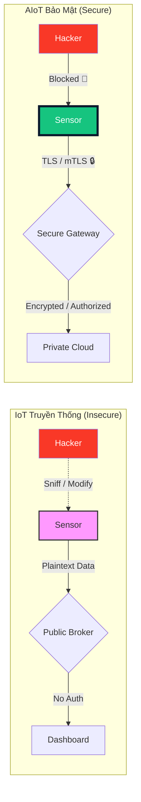
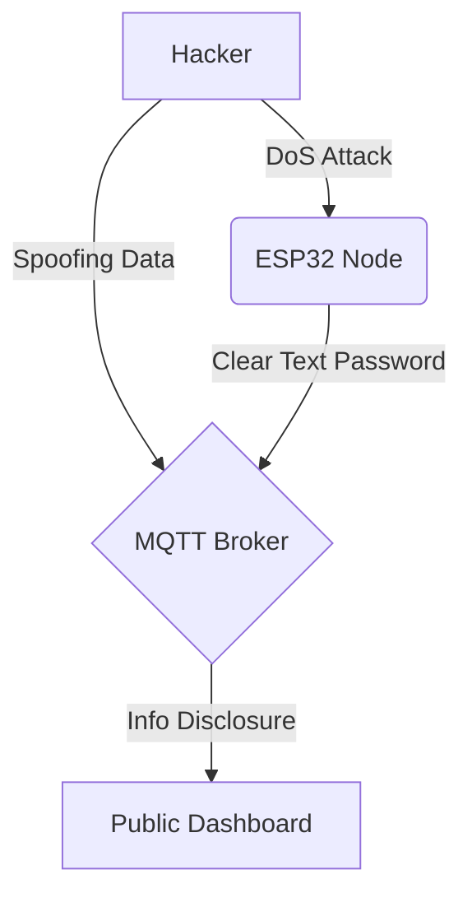

_Tạo bởi: @content | Phiên bản: v1.1 | Ngày: 2026-04-07_
_Unit: HP7: IoT Security | Module: M7.1: Threat Modeling | Prerequisite: Toàn bộ HP1-HP6_

## 0. Tổng quan Bài học (Overview)
- **Thời lượng dự kiến:** 90 phút
- **Mục tiêu bài học (Learning Objectives):**
  - Sau bài này, học sinh có thể **Phân tích** các lỗ hổng tiềm tàng của một thiết bị IoT bằng mô hình STRIDE.
  - Sau bài này, học sinh có thể **Giải thích** sự khác biệt giữa An ninh mạng (Cybersecurity) và An toàn vật lý (Physical Safety) trong IoT.
- **Vật liệu & Thiết bị:**
  - Máy tính cá nhân.
  - Giấy A3 & Bút màu cho hoạt động vẽ bản đồ tấn công.
  - Slide bài giảng về các vụ tấn công IoT nổi tiếng (Mirai Botnet, Jeep Hack).
- **Từ khóa / Khái niệm mới:** Attack Surface (Bề mặt tấn công), STRIDE, CIA Triad (Bảo mật - Toàn vẹn - Sẵn sàng), Threat Modeling.

---

## 1. Engage (Gắn kết) — 15 phút
**Câu chuyện: "Bữa sáng rực lửa"**
Giáo viên kể chuyện (hoặc cho xem video) về một chiếc "Lò nướng thông minh" bị hacker chiếm quyền điều khiển. Thay vì nướng bánh mì, nó được lệnh bật công suất tối đa liên tục cho đến khi gây hỏa hoạn. 
- **Câu hỏi gợi mở:** "Ai là người có lỗi? Nhà sản xuất lò nướng, người mua lò nướng, hay... chính kỹ sư viết code cho nó?"
- **Dẫn dắt:** Trong IoT, một dòng code hớ hênh không chỉ làm mất dữ liệu, nó có thể gây nguy hiểm đến tính mạng.

---

## 2. Explore (Khám phá) — 10 phút
**Hoạt động: "Đột nhập Trạm thời tiết" (Brainstorming)**
- **Nhiệm vụ:** Chia lớp thành các nhóm 3 học sinh. Mỗi nhóm được giao một sơ đồ trạm thời tiết IoT (Sensor -> ESP32 -> WiFi -> MQTT -> Dashboard).
- **Thử thách:** Hãy liệt kê ít nhất 3 cách bạn có thể "phá" hệ thống này mà không cần động vào phần cứng. 
- **Ghi chú:** Học sinh chưa cần biết thuật ngữ chuyên môn, chỉ cần nêu ý tưởng (vd: "em sẽ gửi tin nhắn giả", "em sẽ rút dây mạng", "em làm cho máy bận không làm việc được").
- **Hành động:** Giáo viên ghi nhanh các ý tưởng lên bảng.

---

## 3. Explain (Giải thích) — 30 phút

### Concept 1: Bề mặt tấn công (Attack Surface)
Hãy tưởng tượng hệ thống IoT của bạn là một ngôi nhà.
- Một ngôi nhà truyền thống chỉ có cửa chính và cửa sổ.
- Một ngôi nhà IoT có thêm: Cửa lách (WiFi), khe hở tường (Bluetooth), ống khói (Cloud), và thậm chí là cửa sổ ảo (Mobile App).
**Kỹ sư IoT** phải biết mọi lối vào mà một hacker có thể sử dụng.

### Concept 2: Mô hình STRIDE - Vũ khí của Hacker
Để không bỏ sót bất kỳ lỗi nào, chúng ta dùng bộ quy tắc **STRIDE** (Phát triển bởi Microsoft):
1. **S**poofing (Giả mạo): Giả danh thiết bị để gửi dữ liệu giả.
2. **T**ampering (Xáo trộn): Sửa đổi dữ liệu hoặc firmware.
3. **R**epudiation (Chối bỏ): Xóa dấu vết, chối bỏ hành vi gây lỗi.
4. **I**nformation Disclosure (Tiết lộ thông tin): Rò rỉ dữ liệu nhạy cảm.
5. **D**enial of Service (Từ chối dịch vụ): Làm quá tải hệ thống.
6. **E**levation of Privilege (Leo thang đặc quyền): Chiếm quyền điều khiển cao hơn.

### Concept 3: CIA Triad - Giáp trụ của Kỹ sư
Để đối phó với STRIDE, kỹ sư IoT bảo vệ hệ thống dựa trên 3 trụ cột (CIA):
1. **C**onfidentiality (Tính bảo mật): Chỉ người được phép mới đọc được dữ liệu (vd: Mã hóa dữ liệu). -> Chống lại **I**.
2. **I**ntegrity (Tính toàn vẹn): Dữ liệu không bị sửa đổi trái phép (vd: Dùng Hash code). -> Chống lại **T, S**.
3. **A**vailability (Tính sẵn sàng): Hệ thống luôn hoạt động khi cần (vd: Chống DoS). -> Chống lại **D**.

### Concept 4: So sánh IoT Truyền thống vs AIoT Bảo mật
Để hiểu tại sao chúng ta cần HP7, hãy xem sự khác biệt giữa một thiết bị "nói tự do" và một thiết bị "nói có kiểm soát":

---

## 4. Elaborate (Mở rộng) — 40 phút

**Hoạt động: Lập bản đồ STRIDE cho Trạm quan trắc thời tiết**
Giáo viên cùng học sinh phân tích trạm ESP32 gửi dữ liệu nhiệt độ lên Dashboard qua WiFi:
- **S:** Nếu hacker gửi nhiệt độ 100 độ C thì sao? -> Dashboard báo cháy giả.
- **I:** Nếu MQTT broker không có pass? -> Cửa hàng xóm cũng nhìn thấy nhà bạn nóng hay lạnh.
- **D:** Hacker ping liên tục vào ESP32? -> Sensor không kịp đọc dữ liệu.

**Thực hành Tự do (Independent Practice):**

**Thử thách 1: "Đóng vai Kẻ trộm Trí thức"**
Học sinh làm việc theo nhóm 2-3 người. Mỗi nhóm nhận được một thiết bị AIoT giả định (vd: Khóa cửa thông minh, Máy cho cá ăn tự động). 
- **Nhiệm vụ:** Tìm ít nhất 3 lỗ hổng thuộc STRIDE và đề xuất 1 cách khắc phục đơn giản (vd: thêm mật khẩu, dùng HTTPS).

**Thử thách 2: "Phá đóng băng dữ liệu"**
Học sinh sử dụng công cụ **MQTT Explorer** trên máy tính:
1.  **Giai đoạn 1 (Lắng nghe):** Kết nối vào một Broker được giáo viên chuẩn bị sẵn (vd: `broker.emqx.io`). Tìm các topic có tên như `shome/kitchen/temp` đang gửi dữ liệu không mã hóa.
2.  **Giai đoạn 2 (Tấn công T-Tampering):** Gửi một message đè lên topic đó với giá trị cực đoan (vd: `-273`) để xem Dashboard của nhóm bạn bên cạnh phản ứng thế nào.
3.  **Giai đoạn 3 (Báo cáo):** Điền vào STRIDE Matrix: "Hacker đã thực hiện hành vi **T** qua việc can thiệp vào message MQTT do thiếu cơ chế Authentication."

---

## 5. Evaluate (Đánh giá) — 5 phút
- **Chốt lại:** Bảo mật không phải là thêm một cái pass, mà là thay đổi tư duy từ "Nó hoạt động thế nào?" sang "Nó có thể bị phá hỏng thế nào?".
- **Quiz nhanh:** "Việc hacker sửa đổi firmware của bạn khi bạn đang ngủ thuộc chữ cái nào trong STRIDE?" (Đáp án: T - Tampering).

### Rubric Đánh giá: Phân tích Threat Model (Bloom: Analyze)

| Tiêu chí | Mức 1: Cần cố gắng | Mức 2: Đạt | Mức 3: Tốt |
|---|---|---|---|
| **Nhận diện STRIDE** | Chỉ nhận diện được 1-2 lỗi đơn giản. | Nhận diện đúng ít nhất 4/6 thành phần STRIDE trong hệ thống cho trước. | Nhận diện đầy đủ 6 thành phần và giải thích được nguyên nhân gốc rễ. |
| **Đề xuất giải pháp** | Giải pháp mơ hồ (vd: "làm cho nó an toàn hơn"). | Đề xuất được giải pháp kỹ thuật cụ thể (vd: thêm Password, dùng Hash). | Đề xuất giải pháp tối ưu kèm theo phân tích đánh đổi (trade-off) về hiệu năng. |

---

## 7. Ghi chú cho Giáo viên (Teacher Notes)
- **Lỗi thường gặp:** Học sinh thường bị nhầm lẫn giữa Spoofing (giả mạo ai đó) và Tampering (sửa đổi cái gì đó). Hãy lấy ví dụ về việc "Ký giả chữ ký" (Spoofing) và "Tẩy xóa con số trên hợp đồng" (Tampering).
- **Extension:** Giới thiệu thêm về khái niệm **Zero Trust** - Đừng tin bất kỳ ai, kể cả thiết bị trong cùng mạng nội bộ.

---

## 8. Slide Design (Bản phác thảo Slide)

| Slide | Tiêu đề | Nội dung chính | Ghi chú Assets |
|---|---|---|---|
| 1 | Title | Vũ khí của Hacker & Giáp trụ Kỹ sư | `hp7_banner.png` |
| 2 | Engage | Câu chuyện "Bữa sáng rực lửa" (Lò nướng bị hack) | Hình ảnh đám cháy/Lò nướng |
| 3 | Explore | Thử thách: Đột nhập Trạm thời tiết (Brainstorm) | Sơ đồ hệ thống IoT |
| 4 | Explain | Concept: Bề mặt tấn công (Attack Surface) | Hình ảnh Ngôi nhà nhiều cửa |
| 5 | Explain | Mô hình STRIDE (S-T-R-I-D-E) | Icon 6 loại tấn công |
| 6 | Explain | Trụ cột CIA (C-I-A) | Hình ảnh cái Khiên/Trụ cột |
| 7 | Explain | So sánh: IoT Insecure vs AIoT Secure | `mermaid` diagram 1 |
| 8 | Elaborate | Hoạt động: Lập bản đồ STRIDE thực tế | Bảng ma trận STRIDE |
| 9 | Elaborate | Lab: MQTT Explorer - Nghe lén dữ liệu | Ảnh chụp MQTT Explorer |
| 10 | Elaborate | Lab: Tấn công đè dữ liệu (Tampering) | Ảnh Dashboard bị đổi số |
| 11 | Evaluate | Tổng kết & Quiz nhanh | Bộ câu hỏi trắc nghiệm |
| 12 | Summary | Thông điệp: Thay đổi tư duy Bảo mật | QR code tài liệu đọc thêm |