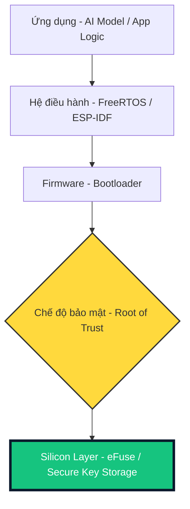
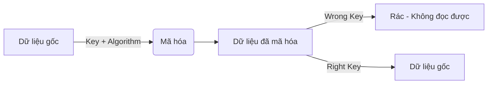

<!-- [SME_MANDATE] -->
<!-- 
  Tạo bởi: Curriculum OS Builder (@content)
  Phase: P3 | Deliverable: P3-T2
  Version: v1.0 | Ngày: 2026-04-07
-->

_Tạo bởi: @content | Phiên bản: v1.0 | Ngày: 2026-04-07_
_Unit: HP7: IoT Security | Module: M7.2: Cryptography | Prerequisite: Bài 01: STRIDE_

- [x] 2.1 Lesson HP7-01: STRIDE Threat Modeling
- [x] 2.2 Lesson HP7-02: Cryptography Concepts
- [x] 2.3 Lesson HP7-03: Identity & Authentication
- [x] 2.4 Lesson HP7-04: Lab: mTLS Setup
- [/] 2.5 Lesson HP7-05: Secure Boot & Flash

## 0. Tổng quan Bài học (Overview)
- **Thời lượng dự kiến:** 90 phút
- **Mục tiêu bài học (Learning Objectives):**
  - Sau bài này, học sinh có thể **Phân biệt** được Mã hóa đối xứng và Mã hóa bất đối xứng.
  - Sau bài này, học sinh có thể **Sử dụng** hàm Hash để kiểm tra tính toàn vẹn của dữ liệu.
  - Sau bài này, học sinh có thể **Giải thích** tại sao không bao giờ được lưu mật khẩu dưới dạng văn bản thuần túy (Plaintext).
- **Vật liệu & Thiết bị:**
  - Máy tính, kết nối Internet.
  - Công cụ Online: [CyberChef](https://gchq.github.io/CyberChef/) (để thực hành mã hóa trực quan).
- **Từ khóa / Khái niệm mới:** Plaintext, Ciphertext, Key, Hash, AES, RSA.

---

## 1. Engage (Gắn kết) — 15 phút
**Thử thách: "Bức thư tuyệt mật"**
Giáo viên đưa cho hai học sinh (A và B) một hộp có lỗ để luồn khóa, nhưng chỉ có một ổ khóa duy nhất và Chìa khóa thì đang ở xa.
- **Câu hỏi:** Làm sao để A gửi một vật quý giá cho B mà không ai ở giữa (kể cả giáo viên) có thể lấy được? 
- **Dẫn dắt:** Trong thế giới IoT, dữ liệu bay qua WiFi cũng giống như cái hộp đó. Chúng ta cần "khóa" nó lại bằng toán học.

---

## 3. Explain (Giải thích) — 30 phút

### Concept 0: Nền móng bảo mật - Root of Trust (RoT)
Trước khi học về cách mã hóa, hãy tự hỏi: "Nếu hacker thay đổi chính con chip của bạn thì sao?". Bảo mật IoT bắt đầu từ tầng cứng nhất:

*Ghi chú: Silicon RoT (Căn cứ tin cậy từ chip) là "mỏ neo" cho toàn bộ hệ thống.*

### Concept 1: Hàm Hash - "Dấu vân tay" của dữ liệu
Hash không phải là mã hóa (vì không thể "giải mã" ngược lại). 
- **Analogy:** Bạn có thể làm ra một chiếc bánh burger từ một con bò, nhưng không thể biến burger trở lại thành con bò. Tuy nhiên, nếu con bò thay đổi (dù chỉ là một sợi lông), chiếc burger sẽ trông hoàn toàn khác.
- **Ứng dụng:** Kiểm tra xem Firmware tải về có bị Hacker sửa hay không (Checksum).

### Concept 2: Mã hóa Đối xứng (Symmetric) - Một chìa khóa cho tất cả
Cả người gửi và người nhận dùng chung **một chìa khóa** bí mật.
- **Đại diện:** **AES** (Advanced Encryption Standard).
- **Ưu điểm:** Rất nhanh, phù hợp cho ESP32 xử lý hàng ngàn dữ liệu sensor mỗi giây.
- **Nhược điểm:** Nếu lộ chìa khóa, coi như mất hết.

### Concept 3: Mã hóa Bất đối xứng (Asymmetric) - Cặp đôi khóa Công khai & Bí mật
Gồm 2 khóa: **Public Key** (Khóa công khai - dùng để khóa) và **Private Key** (Khóa bí mật - dùng để mở).
- **Analogy:** Bất kỳ ai cũng có thể đẩy cửa khóa (Public Key) nhưng chỉ người giữ chìa mới mở được (Private Key).
- **Đại diện:** **RSA**, **ECC** (Elliptic Curve Cryptography).
- **Ứng dụng:** Dùng để trao đổi "Chìa khóa đối xứng" một cách an toàn lúc bắt đầu kết nối.

---

## 2. Explore (Khám phá) — 20 phút
**Hoạt động: Nấu lẩu dữ liệu với CyberChef**
Giáo viên hướng dẫn học sinh truy cập CyberChef và thực hiện các bước:
1. Nhập văn bản: `Hello IoT World`.
2. Dùng hàm `SHA256` -> Quan sát chuỗi ký tự lạ (Hash).
3. Đổi chữ `H` thành `h` -> Quan sát sự thay đổi toàn bộ của chuỗi Hash (Hiệu ứng Avalanche).
4. Thực hành mã hóa `AES Encrypt` với chìa khóa `curriculum123`.

---

## 4. ELABORATE (Mở rộng) — 20 phút

Học sinh vận dụng kiến thức vừa học vào bài thực hành lập trình:

- **Thực hành:** Sử dụng thư viện `pycryptodome` để mã hóa chuỗi ký tự (vd: mật khẩu WiFi) bằng thuật toán AES-CBC.
- **Yêu cầu:** Key và IV tự chọn, đầu ra chuyển thành chuỗi Base64 để lưu trữ.

**Tài liệu mã nguồn mẫu:**
- [AES_Example_Python](file:///Users/tonypham/MEGA/my-agents/packages/the-ultimate-curriculum-agent-os/projects/pathway-aiot/_code/hp7/lesson_02/aes_example.py)

---

## 5. EVALUATE (Đánh giá) — 10 phút

**Câu hỏi nhanh:**
1. Tại sao mã hóa AES cần có IV (Initialization Vector)?
2. Làm thế nào để giải mã được một file nếu chỉ có Ciphertext mà không có Key? (Phân biệt giữa Brute force và phân tích mật mã).

⬤ PLACEHOLDER: @assessor sẽ bổ sung Tiêu chí Đánh giá chi tiết tại đây.

### Rubric Đánh giá: Kỹ năng Mật mã học (Bloom: Apply)

| Tiêu chí | Mức 1: Cần cố gắng | Mức 2: Đạt | Mức 3: Tốt |
|---|---|---|---|
| **Sử dụng AES** | Chưa cài đặt được thư viện hoặc code lỗi. | Thực hiện được mã hóa/giải mã cơ bản nhưng fix cứng Key trong code. | Thực hiện tốt và hiểu vai trò của IV (Initialization Vector) trong bảo mật. |
| **Giải thích Logic** | Không giải thích được sự khác biệt giữa Đối xứng và Bất đối xứng. | Phân biệt được AES và RSA/Hash ở mức cơ bản. | Giải thích được tại sao IoT thường ưu tiên dùng AES cho dữ liệu sensor. |

---

## 7. Ghi chú cho Giáo viên (Teacher Notes)

- **Lưu ý kỹ thuật:** ESP32 hỗ trợ tăng tốc phần cứng cho AES và SHA, giúp việc bảo mật không làm chậm hệ thống quá nhiều.
- **Common Pitfall:** Học sinh hay nhầm Hash là mã hóa có thể giải được. Hãy nhấn mạnh Hash là "một đi không trở lại".
- **Extension:** Giới thiệu về giới hạn của ESP32 khi chạy RSA (rất chậm nếu key quá dài), đó là lý do tại sao ECC (Elliptic Curve) thường được dùng thay thế trong IoT.

---

## 8. Slide Design (Thiết kế Bài giảng)

| Slide # | Tiêu đề | Nội dung chính | Ghi chú minh họa |
| :--- | :--- | :--- | :--- |
| S1 | Mật mã học IoT | Vai trò của mã hóa trong an ninh thiết bị | Hình ảnh ổ khóa IoT |
| S2 | Thông điệp bí mật | Khái niệm Plaintext vs Ciphertext | Sơ đồ chuyển đổi đơn giản |
| S3 | Lịch sử mật mã | Từ Caesar Cipher đến AES hiện đại | Hình ảnh máy Enigma |
| S4 | Đối xứng (Symmetric) | Nguyên lý dùng một khóa duy nhất | [SME_MANDATE] Sơ đồ khóa cửa |
| S5 | Bất đối xứng (Asymmetric) | Cặp khóa Public/Private Key | Sơ đồ hộp thư có 2 khóa |
| S6 | Hàm băm (Hash) | "Dấu vân tay" của dữ liệu | Hình ảnh SHA-256 cơ chế băm |
| S7 | AES - Tiêu chuẩn Vàng | Giải thích tại sao AES an toàn cho IoT | Biểu đồ độ phức tạp khóa |
| S8 | Lab Time: AES | Hướng dẫn cài đặt thư viện và Key | Screenshot cửa sổ terminal |
| S9 | DEMO Code | Phân tích IV, Padding trong Python | [SME_MANDATE] Hiển thị code mẫu |
| S10 | Ứng dụng thực tế | Token API, MQTT TLS, Password hashing | Danh sách các cổng IoT |
| S11 | Kết luận | Mật mã là lớp giáp bảo vệ dữ liệu | Hình ảnh IoT Gateway bảo vệ |
| S12 | Q&A | Giải đáp thắc mắc và dặn dò bài Lab sau | Icon thảo luận |