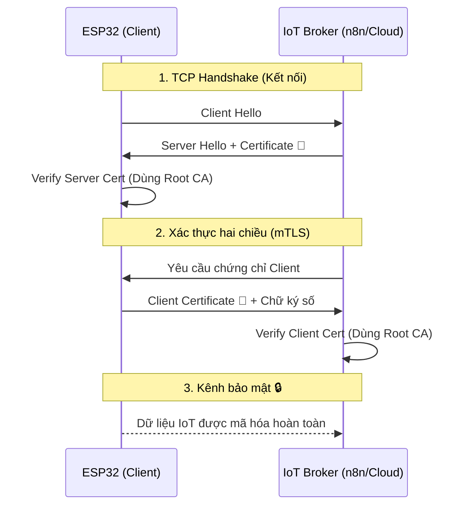

<!-- [SME_MANDATE] -->
<!-- 
  Lesson ID: HP7-03
  Title: Identity & Authentication - Passport của những cỗ máy
  Phase: Phase 4 | Producing
  Version: v1.2 | Ngày: 2026-04-08
-->

---

## 0. Tổng quan Bài học (Overview)

- **Thời lượng:** 90 phút
- **Mục tiêu chính:** Hiểu sâu về hệ thống tin cậy PKI và tự tay tạo chứng chỉ X.509 cho thiết bị IoT.
- **Tiêu chuẩn học thuật:** [SME_MANDATE]
- **Kiến thức tiên quyết:** Hiểu về mã hóa bất đối xứng (Lesson 02).

---

## 1. ENGAGE (Gắn kết) — 15 phút

### Trò chơi: Câu chuyện ở "Cửa khẩu số"
Hãy tưởng tượng bạn đang đi du lịch nước ngoài. Tại cửa khẩu, nhân viên an ninh không hỏi bạn "Bạn là ai?" (vì bạn có thể nói dối), họ hỏi "**Xin cho xem hộ chiếu của bạn?**".

Trong thế giới IoT, các thiết bị cũng cần một loại "Hộ chiếu" như vậy:
- **Identity (Định danh):** "Tôi là cảm biến nhiệt độ số 01".
- **Authentication (Xác thực):** "Đây là chứng chỉ do Server cấp, chứng minh tôi đúng là cảm biến số 01".

**Tại sao phải làm vậy?** Nếu không có hộ chiếu, một kẻ mạo danh có thể gửi dữ liệu "Lò phản ứng đang quá nhiệt" để gây hoảng loạn, dù thực tế mọi thứ vẫn ổn.

---

## 2. EXPLORE (Khám phá) — 20 phút

### Hoạt động: "Xưởng đúc chứng chỉ" (Guided Lab)
Học sinh thực hành tạo hệ thống tin cậy (Trust) bằng script mẫu.

**Tài liệu thực hành:**
- [Cert_Gen_Shell_Script](file:///Users/tonypham/MEGA/my-agents/packages/the-ultimate-curriculum-agent-os/projects/pathway-aiot/_code/hp7/lesson_03/cert_gen.sh)

**Các bước chính:**
1. **Tạo Root CA:** Con dấu của tổ chức (`rootCA.key`, `rootCA.pem`).
2. **Ký nhận thiết bị:** Tạo Certificate Signing Request (CSR) cho ESP32.
3. **Phát hành chứng chỉ:** Dùng Root CA ký xác nhận cho ESP32 (`esp32.crt`).

---

## 3. EXPLAIN (Giải thích) — 30 phút

### Concept 1: ID vs Authentication
Trong IoT, chúng ta có 3 mức độ xác thực phổ biến:

| Mức độ | Công cụ | Độ an toàn | Ý nghĩa thực tế |
| :--- | :--- | :--- | :--- |
| **Thấp** | MAC Address / Device ID | ❌ Rất thấp | Như đeo bảng tên tự viết (dễ bị giả) |
| **Trung bình** | Username / Password | ⚠️ Trung bình | Đọc mật khẩu "Vừng ơi mở ra" (dễ bị lộ) |
| **Cao** | **Digital Certificates (X.509)** | ✅ Rất cao | Hộ chiếu có gắn chip bảo mật (mã hóa RSA) |

### Concept 2: Hệ thống PKI (Public Key Infrastructure)
Để Certificate hoạt động, chúng ta cần một "**Nhà phát hành hộ chiếu**" uy tín, gọi là **CA (Certificate Authority)**.
1. **Device:** Tạo một cặp Private/Public Key.
2. **CA:** Ký tên vào Public Key của Device để tạo ra **Digital Certificate**.
3. **Server:** Kiểm tra chữ ký của CA. Nếu chữ ký đúng, Server tin tưởng Device.

---

## 4. ELABORATE (Mở rộng) — 20 phút

### Quy trình mTLS (Mutual TLS) trong IoT
Trong IoT, không chỉ Client kiểm tra Server, mà Server cũng phải kiểm tra Client.

---

## 5. EVALUATE (Đánh giá) — 5 phút

⬤ PLACEHOLDER: @assessor bổ sung Rubric tại đây.

**Câu hỏi thảo luận:**
1. Tại sao MAC Address không được coi là một phương thức xác thực an toàn?
2. Nếu Private Key của Root CA bị hacker lấy mất, hậu quả nghiêm trọng nhất là gì? (Gợi ý: Mọi thiết bị giả mạo đều có thể trở thành thiết bị "thật").

---

## 7. Ghi chú cho Giáo viên (Teacher Notes)
- Bài học này đặt nền tảng lý thuyết cực kỳ quan trọng cho bài thực hành mTLS (HP7-04) tiếp theo.
- Hãy nhấn mạnh rằng: "**Private Key là bí mật tuyệt đối**". Nếu lộ Private Key, toàn bộ hệ thống bảo mật sẽ sụp đổ.

---

## 8. Slide Design (Thiết kế Bài giảng)

| Slide # | Tiêu đề | Nội dung chính | Ghi chú minh họa |
| :--- | :--- | :--- | :--- |
| S1 | "Hộ chiếu" IoT | Tầm quan trọng của xác thực thiết bị | Hình ảnh cửa khẩu sân bay |
| S2 | Identity vs Authentication | Phân biệt "Tên gọi" và "Bằng chứng" | Ảnh thẻ sinh viên vs Passport |
| S3 | Lỗ hổng MAC Address | Tại sao ID vật lý dễ bị giả mạo | Demo Tool giả mạo MAC |
| S4 | Hệ thống PKI | Vai trò của CA và sự tin tưởng | Hình ảnh con dấu đại sứ quán |
| S5 | Cặp chìa khóa RSA | Private Key vs Public Key | Minh họa ổ khóa và chìa |
| S6 | Chứng chỉ X.509 | Cấu trúc một Certificate chuẩn | [SME_MANDATE] Infographic X.509 |
| S7 | Quy trình mTLS | Tại sao cần xác thực 2 chiều? | Sơ đồ Mermaid mTLS |
| S8 | Lab: Openssl | Hướng dẫn các lệnh Terminal cơ bản | [SME_MANDATE] Screenshot lệnh |
| S9 | Root CA & Client | Mối quan hệ "Cha - Con" trong Cert | Sơ đồ phả hệ chứng chỉ |
| S10 | Bảo mật Key | Cách lưu trữ Key an toàn trên ESP32 | Ảnh chip NVS/SPIFFS 🔒 |
| S11 | Q&A | Giải đáp các thắc mắc kỹ thuật | Icon thảo luận |