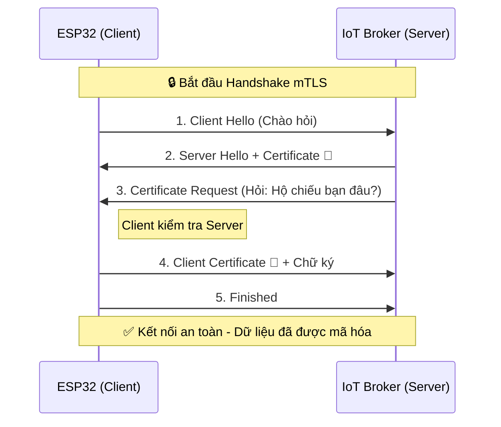

<!-- [SME_MANDATE] -->
<!-- 
  Lesson ID: HP7-04
  Title: Lab: Thiết lập mTLS - "Cái bắt tay" tin cậy tuyệt đối
  Phase: Phase 4 | Producing
  Version: v1.2 | Ngày: 2026-04-08
-->

---

## 0. Tổng quan Bài học (Overview)

- **Thời lượng:** 120 phút (Thực hành 90%)
- **Mục tiêu chính:** Hiện thực hóa cơ chế xác thực hai chiều (Mutual Authentication) giữa ESP32 và Server.
- **Tiêu chuẩn học thuật:** [SME_MANDATE]
- **Kiến thức tiên quyết:** Đã hoàn thành Lesson 03 (Tạo chứng chỉ X.509).

---

## 1. ENGAGE (Gắn kết) — 15 phút

### Scenario: "Lòng tin hai chiều"
Trong bài trước, Server kiểm tra ESP32 qua chứng chỉ. Nhưng làm sao ESP32 biết nó đang gửi dữ liệu cho đúng Server của bạn chứ không phải một "Server lừa đảo" (Man-in-the-Middle)?

**mTLS (Mutual TLS)** chính là giải pháp an ninh cấp cao nhất:
1. Server kiểm tra "Hộ chiếu" của ESP32.
2. ESP32 cũng yêu cầu kiểm tra "Thẻ ngành" của Server.
**Chỉ khi cả hai tin nhau, đường ống dữ liệu mới được mở.**

---

## 2. EXPLORE (Khám phá) — 45 phút

### Hoạt động: "Thiết lập đường ống bảo mật"
Học sinh tiến hành nạp chứng chỉ và code vào ESP32.

**Mã nguồn thực hành:**
- [ESP32_mTLS_Arduino_Code](file:///Users/tonypham/MEGA/my-agents/packages/the-ultimate-curriculum-agent-os/projects/pathway-aiot/_code/hp7/lesson_04/esp32_mtls.ino)
- [Python_mTLS_Server_Sim](file:///Users/tonypham/MEGA/my-agents/packages/the-ultimate-curriculum-agent-os/projects/pathway-aiot/_code/hp7/lesson_04/server_mtls.py)

> [!IMPORTANT]
> **LƯU Ý VỀ THỜI GIAN (NTP):** mTLS yêu cầu thời gian trên ESP32 phải KHỚP với thời gian thực để kiểm tra tính hợp lệ (Expiration) của chứng chỉ. Bạn **BẮT BUỘC** phải đồng bộ NTP trước khi kết nối.

---

## 3. EXPLAIN (Giải thích) — 20 phút

### Luồng Handshake mTLS (Xác thực đôi bên)

**Sự khác biệt:** HTTPS thông thường chỉ có bước 2. mTLS có thêm bước 3 và 4 cực kỳ quan trọng.

---

## 4. ELABORATE (Mở rộng) — 30 phút

### Thử thách: "Phòng chống Hacker giả mạo"
1. **Thử nghiệm Success:** Dùng đúng bộ chứng chỉ đã ký để kết nối -> Server báo `Handshake SUCCESS`.
2. **Thử nghiệm Fail (Spoofing):** Dùng một chứng chỉ tự ký khác (Self-signed nhưng không qua Root CA) nạp vào ESP32 -> Server phải báo `Handshake FAILED`.
3. **Thử nghiệm NTP:** Tắt chức năng đồng bộ thời gian trên ESP32 -> Kết nối sẽ thất bại do Server coi chứng chỉ là chưa đến hạn hoặc đã quá hạn.

---

## 5. EVALUATE (Đánh giá) — 10 phút

| Tiêu chí | Mức 1: Cần cố gắng | Mức 2: Đạt | Mức 3: Tốt |
| :--- | :--- | :--- | :--- |
| **Kết nối mTLS** | Không kết nối được, không hiểu log lỗi. | Kết nối được với Server Python, giải thích được log log SSL. | Kết nối được và giải thích được cơ chế Verify Root CA. |
| **Xử lý sự cố** | Phụ thuộc hoàn toàn vào hướng dẫn. | Tự khắc phục được lỗi sai Certificate/Key. | Hiểu rủi ro về thời gian (NTP) và xử lý lỗi hiệu quả. |

---

## 7. Ghi chú cho Giáo viên (Teacher Notes)
- Để tiết kiệm thời gian, giáo viên có thể cấp sẵn Server Python đang chạy trên LAN.
- Nhắc nhở học sinh: **Không bao giờ commit Private Key lên GitHub công khai.**

---

## 8. Slide Design (Thiết kế Bài giảng)

| Slide # | Tiêu đề | Nội dung chính | Ghi chú minh họa |
| :--- | :--- | :--- | :--- |
| S1 | Mutual TLS (mTLS) | Giới thiệu cơ chế xác thực 2 chiều | Ảnh bắt tay 🤝 bảo mật |
| S2 | Tại sao cần mTLS? | Chống lại tấn công Man-in-the-Middle | Minh họa Hacker đứng giữa |
| S3 | Luồng Handshake | Chi tiết 5 bước "bắt tay" bảo mật | Sơ đồ Mermaid mTLS |
| S4 | Tầm quan trọng của NTP | Giải thích tại sao "Thời gian là then chốt" | Hình chiếc đồng hồ cát ⏳ |
| S5 | Lab: Setup ESP32 | Các thư viện cần thiết (`WiFiClientSecure`) | Screenshot code thực tế |
| S6 | Lab: Setup Python | Vai trò của Server "Cảnh sát" | Icon Server 🖥️ |
| S7 | Troubleshooting | Các lỗi thường gặp (Cert expired, Wrong Key) | Bảng mã lỗi SSL thường gặp |
| S8 | Practice Challenge | Thử nghiệm kết nối và báo cáo kết quả | Checklist thực hành |
| S9 | Summary | Tổng kết: Khi nào dùng mTLS? | QR code tài liệu chuyên sâu |
\n