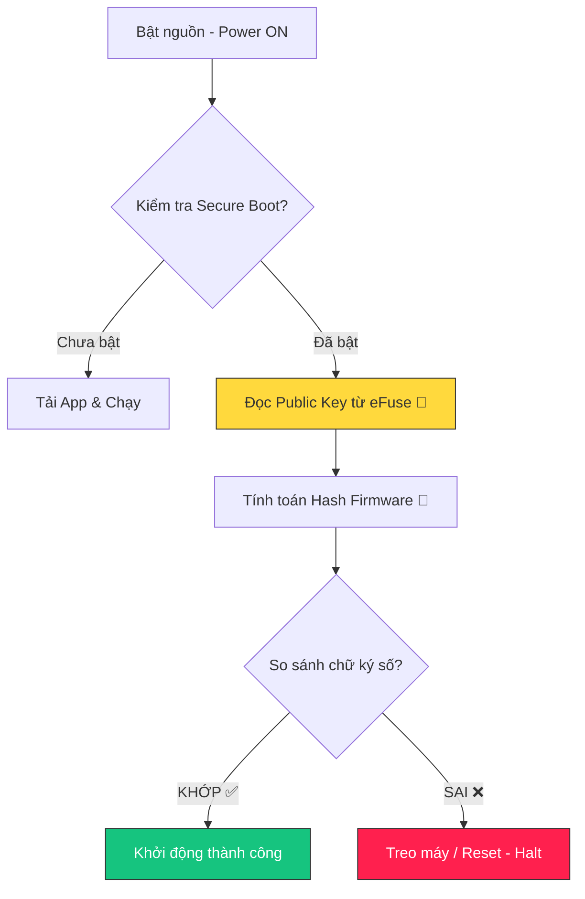

---

## 0. Tổng quan Bài học (Overview)

- **Thời lượng:** 90 phút
- **Mục tiêu chính:** Hiểu và cấu hình cơ chế bảo mật vật lý (At-rest & Integrity) của ESP32.
- **Tiêu chuẩn học thuật:** [SME_MANDATE]
- **Kiến thức cốt lõi:** Flash Encryption (AES-256) và Secure Boot (RSA/ECDSA).

---

## 1. ENGAGE (Gắn kết) — 15 phút

### Scenario: "Kẻ trộm chìa khóa"
Hãy tưởng tượng bạn đã viết một thuật toán AI "triệu đô" và nạp vào ESP32. Một kẻ xấu lẻn vào nhà, lấy trộm thiết bị của bạn. Hắn chỉ cần dùng một sợi cáp USB và lệnh `esptool.py read_flash` là có thể hút toàn bộ code của bạn ra và nhân bản nó. 

**Làm sao để code của bạn "tự hủy" hoặc "trở nên vô nghĩa" khi bị đọc trộm?** 
Đó là lúc chúng ta cần **Secure Boot** và **Flash Encryption**.

---

## 2. EXPLORE (Khám phá) — 20 phút

### Hoạt động: Mô phỏng "Soi mã nguồn" từ Flash
Sử dụng công cụ để xem dữ liệu thô từ chip nhớ chưa mã hóa.
1. Dùng `esptool.py` đọc vùng nhớ chứa thông tin cấu hình.
2. Mở file Hex và tìm kiếm các thông tin nhạy cảm (WiFi SSID, Password).
3. **Thảo luận:** Nếu hacker lấy được mật khẩu WiFi từ ESP32, họ có thể tấn công vào các thiết bị khác trong cùng mạng LAN không?

**Mã nguồn thực hành:**
- [Firmware_Signing_Procedure](file:///Users/tonypham/MEGA/my-agents/packages/the-ultimate-curriculum-agent-os/projects/pathway-aiot/_code/hp7/lesson_05/firmware_signing.sh)

---

## 3. EXPLAIN (Giải thích) — 25 phút

### Quy trình Khởi động An toàn (Secure Boot Flow)

### So sánh Flash Encryption & Secure Boot

| Tính năng | Phương pháp | Mục tiêu | Ví dụ thực tế |
| :--- | :--- | :--- | :--- |
| **Flash Encryption** | Mã hóa AES-256 | **Bảo mật dữ liệu (Privacy)** | Chống bị đọc trộm code khi tháo chip. |
| **Secure Boot** | Chữ ký số (Signature) | **Nguyên vẹn (Integrity)** | Đảm bảo chỉ Firmware của bạn mới được chạy. |

> [!CAUTION]
> **ĐIỂM KHÔNG THỂ ĐẢO NGƯỢC:** Việc đốt eFuse để bật bảo mật trên thiết bị thật là hành động vĩnh viễn. Nếu làm mất "Khóa ký" (Private Key), thiết bị sẽ trở thành "cục gạch" (Brick) vì không thể nạp lại code mới.

---

## 4. ELABORATE (Mở rộng) — 20 phút

### Thử thách: "Nền móng bất biến"
1. **Thiết lập Development Mode:** Tìm hiểu cách cấu hình ESP-IDF để vẫn có thể nạp lại firmware trong khi thử nghiệm Flash Encryption.
2. **Ký firmware:** Tạo khóa Private/Public bằng OpenSSL và thực hiện ký file nhị phân Firmware bằng lệnh CLI.

---

## 5. EVALUATE (Đánh giá) — 10 phút

| Tiêu chí | Mức 1: Cần cố gắng | Mức 2: Đạt | Mức 3: Tốt |
| :--- | :--- | :--- | :--- |
| **Secure Boot** | Chưa phân biệt được Public/Private Key. | Giải thích được cơ chế eFuse và chữ ký số. | Cấu hình chuẩn và nắm rõ quy trình quản lý Key an toàn. |
| **Flash Encryption** | Không biết rủi ro khi dùng Plaintext Flash. | Hiểu rủi ro và cách AES-256 bảo vệ Privacy. | Phân tích được sự khác biệt giữa Hardware & Software encryption. |

---

## 7. Slide Design (Thiết kế Bài giảng)

| Slide # | Tiêu đề | Nội dung chính | Ghi chú minh họa |
| :--- | :--- | :--- | :--- |
| S1 | Hardware Protection | Giới thiệu lớp bảo mật vật lý lớp cuối cùng | Icon pháo đài 🏰 |
| S2 | Flash Attack | Demo hacker đọc trộm code bằng `esptool.py` | Hình ảnh mã Hex thô |
| S3 | Flash Encryption | Cơ chế mã hóa AES cứng trên chip | Sơ đồ Key -> AES -> Flash |
| S4 | Secure Boot Concept | Tại sao chỉ cho phép Firmware "Chính chủ"? | Hình ảnh "Niêm phong" |
| S5 | Luồng Khởi động | Sơ đồ Mermaid: Kiểm tra chữ ký lúc khởi động | Sơ đồ logic rẽ nhánh |
| S6 | eFuse: Cây cầu một chiều | Giải thích cơ chế "đốt" cầu chì điện tử | Đồ họa linh kiện chip 🔬 |
| S7 | Quản lý khóa (Keys) | Tầm quan trọng của việc giữ Private Key an toàn | Hình ảnh két sắt 🔐 |
| S8 | Lab: Firmware Signing | Thực hành tạo khóa và ký Firmware | Screenshot lệnh CLI |
| S9 | Summary & Risks | Tổng kết và cảnh báo về việc "Bricking" | Danh sách Checklist an toàn |

---
_Ghi chú cho giáo viên: Bài học này nhấn mạnh vào khía cạnh "Physical Security" - một điểm yếu chí tử của IoT so với Web truyền thống._
\n