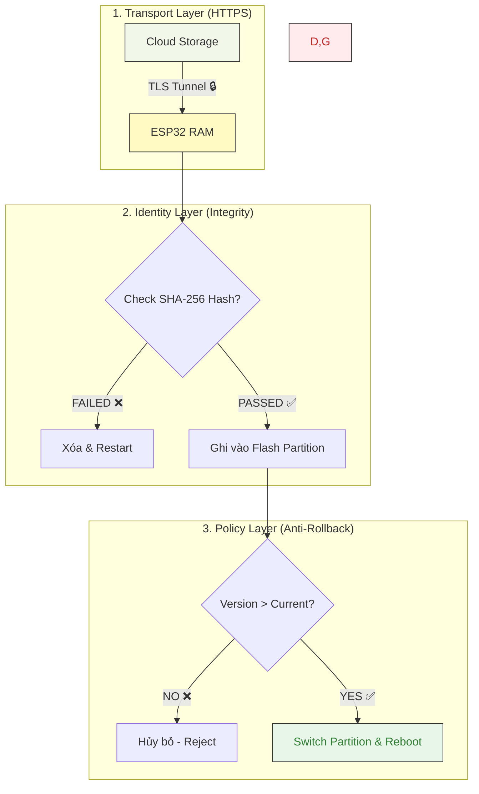

<!-- [SME_MANDATE] -->
<!-- 
  Lesson ID: HP7-06
  Title: Secure OTA - Bản cập nhật từ "Người đưa thư" tin cậy
  Phase: Phase 4 | Producing
  Version: v1.3 | Ngày: 2026-04-08
-->

---

## 0. Tổng quan Bài học (Overview)

- **Thời lượng:** 90 phút
- **Mục tiêu chính:** Triển khai quy trình cập nhật firmware từ xa an toàn (Secure Over-the-Air).
- **Tiêu chuẩn học thuật:** [SME_MANDATE]
- **Kiến thức cốt lõi:** HTTPS Transfer, Signature Verification (Integrity), Anti-rollback policy.

---

## 1. ENGAGE (Gắn kết) — 15 phút

### Scenario: "Cạm bẫy từ trên không"
WiFi nhà bạn bỗng nhiên yêu cầu "Cập nhật phần mềm ngay để tăng tốc độ". Bạn nhấn nút "Đồng ý". Nhưng thực ra, đó là một router giả của hacker đang phát sóng, và bản "cập nhật" đó chính là một con virus sẽ biến router của bạn thành một botnet tấn công mạng.

Trong IoT, cập nhật firmware (**OTA**) là bắt buộc, nhưng nó cũng là con đường ngắn nhất để hacker chiếm quyền điều khiển hàng triệu thiết bị cùng lúc. **Làm sao để ESP32 biết bản cập nhật đến từ bạn chứ không phải từ hacker?**

---

## 2. EXPLORE (Khám phá) — 15 phút

### Luồng Phòng thủ 3 Lớp (Secure OTA Layers)

**Mã nguồn thực hành:**
- [OTA_Payload_Generator](file:///Users/tonypham/MEGA/my-agents/packages/the-ultimate-curriculum-agent-os/projects/pathway-aiot/_code/hp7/lesson_06/ota_payload_gen.py)
- [ESP32_Secure_OTA_Sample](file:///Users/tonypham/MEGA/my-agents/packages/the-ultimate-curriculum-agent-os/projects/pathway-aiot/_code/hp7/lesson_06/esp32_ota_sample.ino)

---

## 3. EXPLAIN (Giải thích) — 20 phút

### Chi tiết 3 Lớp Phòng thủ

1.  **Giao thức An toàn (HTTPS):** Bản firmware được tải xuống qua một đường ống mã hóa, ngăn chặn việc bị nhìn trộm hoặc sửa đổi trên đường đi.
2.  **Ký số & Hàm băm (Integrity):** Firmware phải đi kèm mã Hash (SHA-256) hoặc Chữ ký số. ESP32 sẽ tự "tính toán lại" và so khớp. Nếu sai, nó sẽ xóa bản tải về ngay lập tức.
3.  **Chống hạ cấp (Anti-Rollback):** Hacker có thể cố tình nạp một bản firmware CŨ (vốn có lỗ hổng bảo mật). ESP32 sẽ từ chối bất kỳ bản cập nhật nào có số phiên bản thấp hơn hiện tại.

---

## 4. ELABORATE (Mở rộng) — 30 phút

### n8n: Nhạc trưởng điều phối OTA
Quy trình thực tế trong công nghiệp:
1.  **Developer:** Đẩy file binary mới lên Cloud.
2.  **n8n:** Nhận Webhook -> Tự động tính Hash SHA-256 -> Gửi lệnh cập nhật qua MQTT.
3.  **ESP32:** Nhận lệnh -> Tải file -> So khớp Hash -> Thực thi.

> [!TIP]
> **THỰC HÀNH TỐT:** Luôn chia thiết bị thành nhóm (Beta-test Group) để cập nhật thử nghiệm trước khi tung ra hàng loạt (Rollout).

---

## 5. EVALUATE (Đánh giá) — 10 phút

| Tiêu chí | Mức 1: Cần cố gắng | Mức 2: Đạt | Mức 3: Tốt |
| :--- | :--- | :--- | :--- |
| **Xác thực Firmware** | Chỉ tải file qua HTTP (không mã hóa). | Sử dụng HTTPS và kiểm tra mã Hash SHA-256. | Triển khai được Anti-rollback logic. |
| **Quản lý bằng n8n** | Chưa kết nối được n8n với luồng update. | n8n gửi được Link và Hash qua MQTT thành công. | n8n quản lý được phiên bản và trạng thái thiết bị. |

---

## 7. Slide Design (Thiết kế Bài giảng)

| Slide # | Tiêu đề | Nội dung chính | Ghi chú minh họa |
| :--- | :--- | :--- | :--- |
| S1 | Secure OTA Update | Giới thiệu tầm quan trọng của cập nhật từ xa | Ảnh minh họa vệ tinh/sóng 🛰️ |
| S2 | Cạm bẫy từ trên không | Nguy cơ bị nạp Firmware giả mạo (Malware) | Hình ảnh Malware-IoT |
| S3 | Lớp 1: Transport | Vai trò của HTTPS và Root CA | Icon ổ khóa xanh 🔒 |
| S4 | Lớp 2: Identity | Giải thích cơ chế SHA-256 và Digital Signature | Đồ họa "Dấu vân tay" Firmware |
| S5 | Lớp 3: Policy | Cơ chế Anti-rollback: Chống quay lại phiên bản cũ | Hình ảnh rào chắn 🚧 |
| S6 | Luồng tổng thể | Sơ đồ Mermaid: 3 lớp phòng vệ | Sơ đồ phối hợp 3 lớp |
| S7 | Orchestration: n8n | n8n điều phối quy trình cập nhật hàng loạt | Logo n8n + IoT devices |
| S8 | Lab Practice | Thực hành tính Hash và nạp OTA qua ESP32 | Screenshot VS Code & Dashboard |
| S9 | Summary | Checklist cho một hệ thống OTA an toàn | Bảng Checklist 📋 |

---
_Ghi chú cho giáo viên: Bài học này nhấn mạnh rằng "Cập nhật là tốt, nhưng cập nhật sai là thảm họa."_
\n