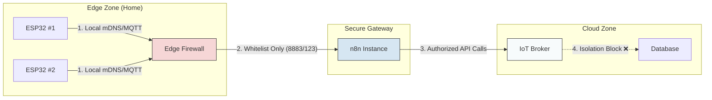

<!-- [SME_MANDATE] -->
<!-- 
  Lesson ID: HP7-07
  Title: Firewalls & Network Isolation - Hàng rào kỹ thuật số
  Phase: Phase 4 | Producing
  Version: v1.3 | Ngày: 2026-04-08
-->

---

## 0. Tổng quan Bài học (Overview)

- **Thời lượng:** 90 phút
- **Mục tiêu chính:** Hiểu và cấu hình hạ tầng mạng để cô lập và bảo vệ thiết bị IoT.
- **Tiêu chuẩn học thuật:** [SME_MANDATE]
- **Kiến thức cốt lõi:** VLANs, Micro-segmentation, Firewall (Whitelist), Attack Surface reduction.

---

## 1. ENGAGE (Gắn kết) — 15 phút

### Scenario: "Quả táo thối" trong giỏ
Giả sử bạn có 50 thiết bị IoT trong nhà. Một con robot hút bụi giá rẻ bị hacker chiếm quyền điều khiển. Nếu tất cả thiết bị nằm chung một mạng, con robot này có thể "quét" toàn bộ mạng LAN, tìm ra máy tính chứa dữ liệu ngân hàng của bạn và tấn công nó.

**Làm sao để nhốt "quả táo thối" này vào một cái lồng riêng để nó không làm hỏng cả giỏ táo?** 
Đó là lúc chúng ta cần **Network Isolation** (Cô lập mạng).

---

## 2. EXPLORE (Khám phá) — 15 phút

### Hoạt động: Phân vùng mạng (Micro-segmentation)
Tại sao không nên để mọi thiết bị "nói chuyện" tự do trong cùng một mạng LAN?
- **VLAN (Virtual LAN):** Một kỹ thuật trên Router để chia mạng vật lý thành nhiều mạng vùng (Subnet) độc lập.
- **Vùng Primary:** Máy tính, điện thoại (Dữ liệu quan trọng).
- **Vùng IoT:** Bóng đèn, robot, cảm biến (Ít tin cậy).

### Sơ đồ Cô lập Mạng (Isolation Diagram)

**Mã nguồn thực hành:**
- [Firewall_Scanner_Simulation](file:///Users/tonypham/MEGA/my-agents/packages/the-ultimate-curriculum-agent-os/projects/pathway-aiot/_code/hp7/lesson_07/firewall_sim.py)

---

## 3. EXPLAIN (Giải thích) — 20 phút

### Cơ chế Tường lửa (Firewall Rules)
Tường lửa hoạt động như một bảo vệ đứng ở cửa mạng, kiểm tra từng gói tin (Packet) dựa trên **Whitelist** (Danh sách trắng):

- **NGUYÊN TẮC VÀNG: Default Deny** (Cấm tất cả trừ những gì cho phép).
- **Ví dụ Whitelist cho ESP32:**
  - Cho phép IP của MQTT Broker qua cổng 8883.
  - Cho phép IP của NTP Server qua cổng 123 (Lấy giờ).
  - **Mọi yêu cầu khác đều bị CHẶN.**

### Bề mặt tấn công (Attack Surface)
Mỗi cổng (port) đang mở trên thiết bị là một cánh cửa. Hacker sẽ dùng công cụ "Quét cổng" để tìm cửa hở. Mục tiêu của chúng ta là ĐÓNG hết mọi cửa không cần thiết.

---

## 4. ELABORATE (Mở rộng) — 30 phút

### Thử thách: "Pháo đài tàng hình"
Học sinh thực hành cấu hình giả định cho một Gateway IoT:
1.  **Dùng Python mô phỏng hacker:** Chạy `firewall_sim.py` để quét các cổng phổ biến.
2.  **Thiết kế luật bảo vệ:** Quyết định những cổng nào cần mở cho ESP32.
3.  **Tối ưu mDNS:** Tìm hiểu rủi ro khi để mDNS `esp32.local` phát sóng công khai trong mạng không tin cậy.

---

## 5. EVALUATE (Đánh giá) — 10 phút

| Tiêu chí | Mức 1: Cần cố gắng | Mức 2: Đạt | Mức 3: Tốt |
| :--- | :--- | :--- | :--- |
| **Phân vùng mạng** | Không phân biệt được WiFi chính và WiFi khách. | Giải thích được lợi ích của VLAN để cách ly IoT. | Thiết kế được sơ đồ phân vùng 3 lớp (Home, Gateway, Cloud). |
| **Bề mặt tấn công** | Chấp nhận mọi kết nối (Default Allow). | Liệt kê đúng các ports cần thiết và đề xuất được Whitelist. | Giải thích được cơ chế hoạt động của "Stealth Mode" trong Firewall. |

---

## 7. Slide Design (Thiết kế Bài giảng)

| Slide # | Tiêu đề | Nội dung chính | Ghi chú minh họa |
| :--- | :--- | :--- | :--- |
| S1 | Digital Barriers | Tầm quan trọng của Firewall trong kiến trúc IoT | Hình ảnh hàng rào tia laser ⚡ |
| S2 | Quả táo thối | Rủi ro của mạng phẳng (Flat Network) | Hình ảnh virus lây lan trong giỏ táo |
| S3 | VLAN & Isolation | Chia mạng vật lý thành các phân vùng ảo độc lập | Sơ đồ phân khu màu sắc khác nhau |
| S4 | Default Deny | Tại sao chính sách "Cấm tất cả" là an toàn nhất? | Icon bảo vệ từ chối mọi khách lạ |
| S5 | Sơ đồ Tường lửa | Sơ đồ Mermaid: Kiểm soát luồng Traffic 3 vùng | Sơ đồ logic luồng dữ liệu |
| S6 | Bề mặt tấn công | Càng nhiều Ports mở, hacker càng dễ xâm nhập | Hình ảnh ngôi nhà quá nhiều cửa sổ 🏠 |
| S7 | Lab: Firewall Sim | Thực hành quét cổng và cảm nhận hiệu quả của IDS | Screenshot terminal scan kết quả |
| S8 | Smart Home Design | Bài tập: Thiết kế mạng an toàn cho 1 ngôi nhà | Sơ đồ mẫu cho biệt thự/căn hộ |
| S9 | Summary | Checklist bảo mật mạng IoT | Danh sách các quy tắc thực hành tốt 📋 |

---
_Ghi chú cho giáo viên: Bài học này giúp học sinh chuyển đổi tư duy từ "Kết nối cho bằng được" sang "Kết nối một cách có kiểm soát"._
\n