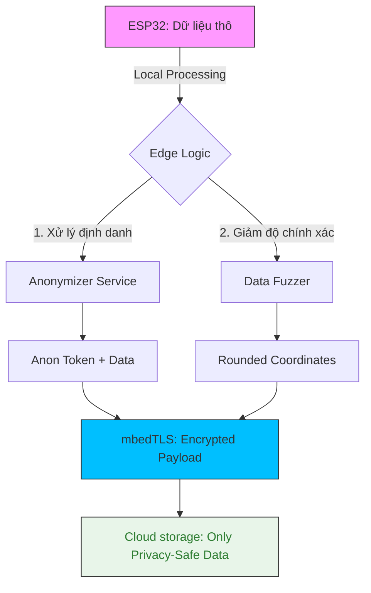

---

## 0. Tổng quan Bài học (Overview)

- **Thời lượng:** 90 phút
- **Mục tiêu chính:** Hiểu và triển khai các nguyên tắc bảo vệ quyền riêng tư người dùng trong thiết kế hệ thống IoT.
- **Tiêu chuẩn học thuật:** [SME_MANDATE]
- **Kiến thức cốt lõi:** Privacy by Design, Data Minimization, GDPR Compliance, Anonymization.

---

## 1. ENGAGE (Gắn kết) — 15 phút

### Scenario: "Dấu chân số" của Sensor
Một thiết bị đo nhịp tim thông minh gửi dữ liệu sức khỏe của bạn lên Cloud. Hacker không cần biết bạn là ai, nhưng hắn có thể suy luận từ các biểu đồ nhịp tim rằng bạn đang ngủ, đang tập yoga hay... vừa gặp chuyện căng thẳng. Dữ liệu này nếu rơi vào tay công ty bảo hiểm, phí bảo hiểm của bạn có thể tăng vọt.

**Trong AIoT, dữ liệu là vàng, nhưng nó cũng là một gách nặng pháp lý và đạo đức.**
Làm sao để vừa thu thập dữ liệu giá trị, vừa không xâm phạm quyền riêng tư?

---

## 2. EXPLORE (Khám phá) — 15 phút

### Hoạt động: Quyền riêng tư theo thiết kế (Privacy by Design)
Hệ thống AIoT an toàn phải tuân thủ các nguyên tắc "Vàng":
1.  **Chỉ lấy những gì cần (Data Minimization):** Đừng lấy dữ liệu từng giây nếu chỉ cần trung bình mỗi phút.
2.  **Giới hạn mục đích (Purpose Limitation):** Dữ liệu y tế không được dùng cho quảng cáo.
3.  **Công khai & Minh bạch:** Người dùng phải có quyền "Yêu cầu xóa dữ liệu".

### Sơ đồ Luồng dữ liệu Riêng tư (Privacy flow)

**Mã nguồn thực hành:**
- [Data_Anonymizer_Script](file:///Users/tonypham/MEGA/my-agents/packages/the-ultimate-curriculum-agent-os/projects/pathway-aiot/_code/hp7/lesson_08/data_anonymizer.py)

---

## 3. EXPLAIN (Giải thích) — 20 phút

### Chi tiết kỹ thuật Bảo vệ Quyền riêng tư
1.  **Mã hóa tại nguồn (Always-on Encryption):** Dữ liệu phải được mã hoá ngay trên ESP32 bằng AES-256 trước khi rời khỏi thiết bị.
2.  **Ẩn danh (Anonymization):** Xóa bỏ Tên, Email, SĐT và thay bằng ID ngẫu nhiên không thể truy ngược.
3.  **Làm mờ dữ liệu (Fuzzing):** Ví dụ: Làm tròn tọa độ GPS xuống 2 chữ số thập phân (độ sai số ~1.1km) để bảo vệ vị trí chính xác của nhà riêng.
4.  **Edge Computing:** Camera AI đếm số người trong phòng nhưng chỉ gửi con số "3" lên Cloud, tuyệt đối không gửi hình ảnh thật.

---

## 4. ELABORATE (Mở rộng) — 30 phút

### GDPR & Nghị định 13
Tại sao bạn phải học bài này?
- **GDPR (Châu Âu):** Mọi thiết bị IoT xuất khẩu sang EU phải tuân thủ chuẩn bảo vệ dữ liệu khắt khe nhất thế giới.
- **Nghị định 13 (Việt Nam):** Yêu cầu doanh nghiệp sử dụng biện pháp kỹ thuật để bảo mật thông tin cá nhân khách hàng.

> [!CAUTION]
> **RỦI RO PHÁP LÝ:** Việc rò rỉ dữ liệu cá nhân nhạy cảm có thể dẫn đến các khoản phạt khổng lồ và mất uy tín thương hiệu vĩnh viễn.

---

## 5. EVALUATE (Đánh giá) — 10 phút

| Tiêu chí | Mức 1: Cần cố gắng | Mức 2: Đạt | Mức 3: Tốt |
| :--- | :--- | :--- | :--- |
| **Giảm thiểu dữ liệu** | Thu thập dư thừa nhiều thông tin cá nhân. | Chỉ lấy các dữ liệu phục vụ mục đích chính. | Áp dụng kỹ thuật Differential Privacy / Fuzzing dữ liệu tốt. |
| **Bảo mật lưu trữ** | Dữ liệu nhạy cảm lưu dạng văn bản thuần (Plaintext). | Dữ liệu nhạy cảm được mã hoá tại nguồn (Edge). | Có cơ chế quản lý vòng đời dữ liệu (Tự động xóa sau X ngày). |

---

## 7. Slide Design (Thiết kế Bài giảng)

| Slide # | Tiêu đề | Nội dung chính | Ghi chú minh họa |
| :--- | :--- | :--- | :--- |
| S1 | Privacy by Design | Triết lý thiết kế tôn trọng người dùng | Hình ảnh vân tay được bảo vệ 🛡️ |
| S2 | Dấu chân cảm biến | Nguy cơ suy luận hành vi từ dữ liệu thô | Ảnh minh họa bóng của dữ liệu 👤 |
| S3 | 3 Nguyên tắc Vàng | Minimization, Purpose, Transparency | Icons: Giọt nước, Bia, Kính lúp |
| S4 | Kỹ thuật #1: Fuzzing | Làm mờ tọa độ GPS và thông tin nhạy cảm | Ảnh minh họa bản đồ bị làm mờ một phần |
| S5 | Kỹ thuật #2: Anonymize | Thay đổi định danh thành Token ngẫu nhiên | Animation: Name -> Token |
| S6 | Kỹ thuật #3: Edge Processing | Xử lý tại biên - Chỉ gửi số liệu, không gửi ảnh | Đồ họa Camera AI đếm người |
| S7 | GDPR & Nghị định 13 | Các yêu cầu pháp lý tại VN và Quốc tế | Logo GDPR và cờ Việt Nam |
| S8 | Lab: Data Protected | Thực hành ẩn danh dữ liệu với Python | Screenshot mã nguồn anonymizer.py |
| S9 | Summary | Đạo đức lập trình viên trong kỷ nguyên AIoT | Quote: "Ethics in every line of code." |

---
_Ghi chú cho giáo viên: Bài học này giúp học sinh hiểu rằng: "Bảo mật là bảo vệ hệ thống, nhưng Quyền riêng tư là bảo vệ Con người."_
\n