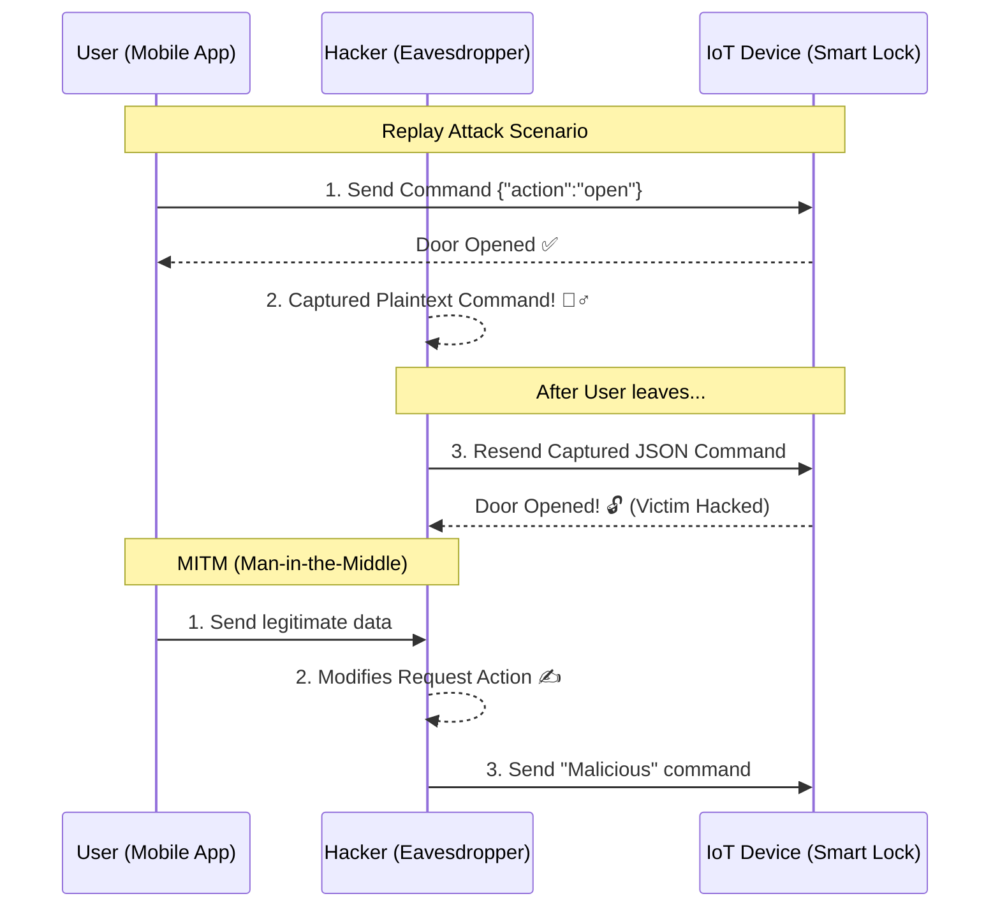

---

## 0. Tổng quan Bài học (Overview)

- **Thời lượng:** 90 phút
- **Mục tiêu chính:** Hiểu và thực hành các kỹ thuật tấn công Capture & Replay, đồng thời triển khai cơ chế chống phát lại.
- **Tiêu chuẩn học thuật:** [SME_MANDATE]
- **Kiến thức cốt lõi:** Replay Attack, MITM, Message Integrity, HMAC, Nonce/Timestamp.

---

## 1. ENGAGE (Gắn kết) — 15 phút

### Scenario: Bắt chước "Người đưa tin"
Bạn có một chiếc khóa cửa thông minh điều khiển qua MQTT. Mỗi khi bạn nhấn nút trên điện thoại, một lệnh `{"action": "open"}` được gửi đi. Hacker đứng gần đó, "nghe trộm" được lệnh này qua WiFi. Vài phút sau khi bạn đi khỏi, hắn chỉ cần "gửi lại" chính xác đoạn mã đó. Cửa mở! 

**Chào mừng bạn đến với thế giới của Replay Attack - một trong những cách đơn giản nhưng hiệu quả nhất để hack IoT.**

---

## 2. EXPLORE (Khám phá) — 15 phút

### Tấn công phát lại & Người đứng giữa (MITM)
- **Replay Attack (Tấn công phát lại):** Hacker không cần giải mã lệnh, chỉ cần bắt gói tin (Packet Sniffing) và gửi lại y hệt để đánh lừa thiết bị.
- **Man-In-The-Middle (MITM):** Hacker đứng giữa thiết bị và server, đóng vai trò là "người trung chuyển" để chỉnh sửa dữ liệu hoặc đánh cắp thông tin bí mật.

### Sơ đồ Kịch bản Tấn công (Attack Sequence)

**Mã nguồn thực hành:**
- [Attack_Defense_Simulation](file:///Users/tonypham/MEGA/my-agents/packages/the-ultimate-curriculum-agent-os/projects/pathway-aiot/_code/hp7/lesson_09/attack_defense_sim.py)

---

## 3. EXPLAIN (Giải thích) — 20 phút

### Cách phòng thủ (Integrity & Freshness)
Để chống lại Replay Attack, chúng ta cần bản tin "luôn thay đổi" (Dynamic Payload):

1.  **Timestamp (Dấu thời gian):** Gắn thêm thời gian hiện tại vào lệnh. Nếu lệnh cũ quá 5 giây, thiết bị sẽ từ chối.
2.  **Nonce (Number used once):** Một số ngẫu nhiên chỉ dùng một lần. Server lưu lại các Nonce đã dùng để không bao giờ chấp nhận lần thứ hai.
3.  **HMAC (Hash-based Message Authentication Code):** Dùng mã Hash (với Secret Key) để đảm bảo nội dung lệnh không bị hacker chỉnh sửa trên đường truyền (Anti-MITM).

---

## 4. ELABORATE (Mở rộng) — 30 phút

### Công cụ "Nghe trộm" MQTT Explorer
Học sinh sử dụng công cụ chuyên sâu để quan sát luồng dữ liệu thực tế:
- **Phân tích:** Xem các topic nhạy cảm như `home/door/control`.
- **Thử nghiệm:** Bắt cấu trúc JSON của lệnh và thử "chế" lại một lệnh mới.
- **Ghi nhật ký:** Ghi lại kết quả khi ESP32 bắt đầu từ chối vì Token hết hạn.

> [!WARNING]
> **RỦI RO MITM:** Ngay cả khi dùng TLS, nếu bạn chấp nhận một chứng chỉ (Certificate) lạ từ trình duyệt hoặc app, hacker vẫn có thể thực hiện tấn công MITM để "xả" toàn bộ dữ liệu mã hoá.

---

## 5. EVALUATE (Đánh giá) — 10 phút

| Tiêu chí | Mức 1: Cần cố gắng | Mức 2: Đạt | Mức 3: Tốt |
| :--- | :--- | :--- | :--- |
| **Bắt gói tin** | Không biết cách sử dụng MQTT Explorer để xem dữ liệu. | Bắt được gói tin và giải thích được nội dung JSON. | Phân tích được các tham số nhạy cảm và rủi ro của bản tin Plaintext. |
| **Phòng thủ Replay** | Thiết bị vẫn bị hack bởi các lệnh gửi lại đơn giản. | Triển khai được cơ chế Timestamp hoặc Nonce cơ bản. | Kết hợp thành công HMAC và Nonce để bảo vệ toàn diện bản tin. |

---

## 7. Slide Design (Thiết kế Bài giảng)

| Slide # | Tiêu đề | Nội dung chính | Ghi chú minh họa |
| :--- | :--- | :--- | :--- |
| S1 | Impersonating the Messenger | Pen-testing: Nghệ thuật "bắt chước" | Hình ảnh Hacker đeo mặt nạ 🕵️‍♂️ |
| S2 | Replay Attack | Cơ chế bắt và gửi lại gói tin đơn giản | Animation: Gói tin bay lặp lại |
| S3 | MITM Attack | Hacker chen ngang luồng dữ liệu bí mật | Sơ đồ 3 người: User - Hacker - Gateway |
| S4 | Sơ đồ Tấn công | Giải thích Mermaid Sequence Diagram | Sơ đồ trình tự từng bước |
| S5 | Message Integrity | Làm sao biết bản tin chưa bị chỉnh sửa? | Hình ảnh con dấu niêm phong ✉️ |
| S6 | Nonce & Timestamp | Kỹ thuật làm cho bản tin "luôn mới" | Ảnh đồng hồ đếm ngược ⏳ |
| S7 | Kỹ thuật HMAC | Dùng Secret Key để ký tên vào bản tin | Hình ảnh mã khóa và mã băm |
| S8 | Lab: Hack the Lock | Thực hành với bộ mô phỏng Python/ESP32 | Screenshot Terminal: Access Denied |
| S9 | Summary | Checklist: Chống phát lại & Bảo vệ tính toàn vẹn | Danh sách các quy tắc thực hành |

---
_Ghi chú cho SME: Bài học này tập trung vào logic của thông điệp (Payload logic) thay vì chỉ ở lớp mã hóa (Encryption)._
\n