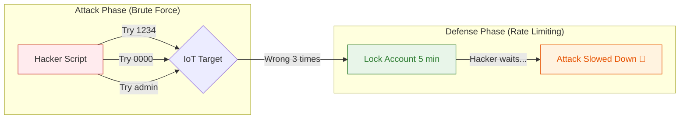

<!-- [SME_MANDATE] -->
<!-- 
  Lesson ID: HP7-10
  Title: Pen-testing IoT 02 - Tấn công bằng "Sức mạnh thô bổ"
  Phase: Phase 4 | Producing
  Version: v1.3 | Ngày: 2026-04-08
-->

---

## 0. Tổng quan Bài học (Overview)

- **Thời lượng:** 90 phút
- **Mục tiêu chính:** Hiểu về kỹ thuật Brute Force, Dictionary Attack và triển khai cơ chế Rate Limiting để bảo vệ tài khoản.
- **Tiêu chuẩn học thuật:** [SME_MANDATE]
- **Kiến thức cốt lõi:** Brute Force, Entropy, Rate Limiting, Password Hashing vs Plaintext.

---

## 1. ENGAGE (Gắn kết) — 15 phút

### Scenario: Mật khẩu "123456"
Hacker có thể không giỏi lập trình, nhưng hắn có trong tay danh sách 1 triệu mật khẩu phổ biến nhất thế giới (RockYou.txt). Hắn chỉ cần viết một kịch bản (Script) để thử từng mật khẩu một vào trang đăng nhập của thiết bị bạn. Trung bình cứ 100 thiết bị thì có 5-10 thiết bị dùng mật khẩu yếu kiểu `admin`, `123456`, `password`.

**Chào mừng bạn đến với thế giới của Brute Force - cuộc tấn công bằng sức mạnh thô và sự kiên trì.**

---

## 2. EXPLORE (Khám phá) — 15 phút

### Brute Force & Dictionary Attack
- **Brute Force (Tấn công vét cạn):** Thử mọi khả năng có thể (ví dụ: mật khẩu 4 chữ số từ `0000` đến `9999`).
- **Dictionary Attack (Tấn công từ điển):** Chỉ thử các từ có nghĩa hoặc các mật khẩu phổ biến lấy từ các vụ leak dữ liệu trước đó.
- **SQL Injection:** Chèn mã độc vào ô nhập liệu để lừa hệ thống cho phép đăng nhập mà không cần mật khẩu.

### Sơ đồ Phòng thủ Rate Limiting

**Mã nguồn Lab đối kháng:**
- [Brute_Force_vs_Rate_Limiting](file:///Users/tonypham/MEGA/my-agents/packages/the-ultimate-curriculum-agent-os/projects/pathway-aiot/_code/hp7/lesson_10/brute_force_lab.py)

---

## 3. EXPLAIN (Giải thích) — 20 phút

### Cơ chế bảo mật Password
Để chặn đứng Brute Force, chúng ta cần làm cho việc thử mật khẩu trở nên "đắt đỏ" (Expensive Attempt):

1.  **Rate Limiting (Giới hạn tốc độ):** Nếu nhập sai X lần, khóa tài khoản trong Y phút. Việc này làm hacker mất hàng năm trời cho 1 triệu lần thử thay vì vài giờ.
2.  **Mật khẩu phức tạp (Entropy):** Yêu cầu Chữ hoa, Chữ thường, Số và Ký tự đặc biệt (Ví dụ: `IoT#2026!`).
3.  **Password Hashing:** Trên bộ nhớ Flash, chúng ta KHÔNG lưu mật khẩu thật. Chúng ta lưu bản băm SHA-256 kèm theo một chuỗi **Salt** (chuỗi ngẫu nhiên) để hacker không thể dùng bảng băm có sẵn (Rainbow Table) để tra ngược mật khẩu.

---

## 4. ELABORATE (Mở rộng) — 30 phút

### Lab Thực hành: Bẻ khóa mật khẩu Admin
Học sinh thực hiện mô phỏng kịch bản tấn công và nâng cấp phòng thủ:
- **Tấn công:** Sử dụng script Python để tự động dò mã PIN 3 chữ số của một Server ảo.
- **Quan sát:** Thấy script bẻ khóa thành công chỉ trong vài giây khi hệ thống không có phòng thủ.
- **Nâng cấp:** Cấu hình Server ảo để khóa 5 giây sau 3 lần sai. Quan sát script tấn công bị đình trệ (Stalled).

> [!TIP]
> **THAY ĐỔI MẶC ĐỊNH:** Luôn bắt buộc người dùng đổi mật khẩu mặc định (ví dụ: `admin/admin`) ngay trong lần khởi động đầu tiên để tránh các vụ hack hàng loạt (Botnet).

---

## 5. EVALUATE (Đánh giá) — 10 phút

| Tiêu chí | Mức 1: Cần cố gắng | Mức 2: Đạt | Mức 3: Tốt |
| :--- | :--- | :--- | :--- |
| **Script tấn công** | Không hiểu cách kết nối Script với Server để thử mật khẩu. | Viết được script cơ bản để thử mật khẩu tự động. | Tối ưu được script (đa luồng) và hiểu lỗi HTTP Response. |
| **Bảo mật thiết bị** | Thiết bị cho phép thử mật khẩu vô tận tốc độ cao. | Triển khai được cơ chế delay/khóa tạm thời cơ bản. | Thiết kế được cơ chế Password Hashing và Exponential Backoff (Khóa lâu dần). |

---

## 7. Slide Design (Thiết kế Bài giảng)

| Slide # | Tiêu đề | Nội dung chính | Ghi chú minh họa |
| :--- | :--- | :--- | :--- |
| S1 | Brute Force Attack | Tấn công bằng sức mạnh thô | Hình ảnh một chiếc chìa khóa vạn năng 🔑 |
| S2 | Dictionary Attack | Dùng từ điển mật khẩu phổ biến | Hình ảnh quyển từ điển chứa mã độc |
| S3 | Rate Limiting | Kỹ thuật "Câu giờ" hacker | Animation: Đồng hồ cát ⏳ |
| S4 | Sơ đồ Đối kháng | Giải thích Mermaid Graph LR | Sơ đồ luồng Tấn công - Phòng vệ |
| S5 | Password Entropy | Tại sao mật khẩu dài lại an toàn? | Đồ họa so sánh 4 số vs 16 ký tự |
| S6 | Hashing & Salting | Không bao giờ lưu mật khẩu Plaintext | Hình ảnh máy xay mật khẩu thành mã băm |
| S7 | Default-to-Secure | Quy tắc đổi mật khẩu lần đầu | Ảnh thông báo "Please Change Password" |
| S8 | Lab: Cracking PIN | Thực hành bẻ khóa mã PIN 3 số | Screenshot code Python đối kháng |
| S9 | Summary | Đạo đức Pen-tester & Checklist bảo vệ | Quote: "Security is a marathon, not a sprint." |

---
_Ghi chú cho giáo viên: Đây là bài học thực hành có tính đối kháng cao, giúp học sinh nhận ra sự mỏng manh của mật khẩu yếu._
\n