---

## 0. Tổng quan Bài học (Overview)

- **Thời lượng:** 90 phút
- **Mục tiêu chính:** Hiểu quy trình CVE, thực hành Audit mã nguồn và triển khai Hardening (làm cứng) hệ thống IoT.
- **Tiêu chuẩn học thuật:** [SME_MANDATE]
- **Kiến thức cốt lõi:** CVE Tracking, Vulnerability Lifecycle, System Hardening, OTA Patching.

---

## 1. ENGAGE (Gắn kết) — 15 phút

### Scenario: Cuộc đua không bao giờ kết thúc
Bạn vừa hoàn thành một dự án IoT tuyệt vời. Nhưng sáng hôm sau, trang tin công nghệ báo: *"Lỗ hổng nghiêm trọng tìm thấy trong thư viện WiFi của ESP32, cho phép hacker chiếm quyền điều khiển từ xa"*. Bạn sẽ làm gì? Tắt toàn bộ thiết bị của khách hàng? Hay tìm cách vá nó thầm lặng?

**Trong thế giới bảo mật, không có gì là an toàn mãi mãi. Bảo mật là một cuộc đua liên tục.**

---

## 2. EXPLORE (Khám phá) — 15 phút

### Vòng đời của một Lỗ hổng Bảo mật (Vulnerability Lifecycle)
1.  **Vulnerability Discovery:** Hacker hoặc Chuyên gia tìm thấy lỗi.
2.  **CVE Assignment:** Gán mã định danh quốc tế (Ví dụ: `CVE-2023-xxxx`).
3.  **Vendor Advisory:** Nhà sản xuất thông báo và phát hành bản vá (Patch).
4.  **OTA Deployment:** Thiết bị tự động cập nhật bản vá từ xa.

### Sơ đồ Quy trình Vá lỗi

```mermaid
graph LR
    A[Vulnerability Discovery] --> B[CVE Assignment]
    B --> C[Vendor Advisory]
    C --> D[Patch Development]
    D --> E[Staging/Beta Testing]
    E --> F[OTA Deployment]
    F --> G[Monitoring & Feedback]
    
    style B fill:#FFCDD2,stroke:#C62828,stroke-width:2px,color:#C62828
    style D fill:#C8E6C9,stroke:#2E7D32,stroke-width:2px,color:#2E7D32
    style F fill:#BBDEFB,stroke:#1565C0,stroke-width:2px,color:#1565C0
```

**Mã nguồn Lab Audit:**
- [Vulnerability_Scanner_Script](file:///Users/tonypham/MEGA/my-agents/packages/the-ultimate-curriculum-agent-os/projects/pathway-aiot/_code/hp7/lesson_11/vulnerability_scanner.py)

---

## 3. EXPLAIN (Giải thích) — 20 phút

### Hardening Checklist (Làm cứng hệ thống)
Sau khi xây dựng xong một hệ thống, chúng ta cần thực hiện "Hardening" để giảm thiểu bề mặt tấn công (Attack Surface):

1.  **Đóng các cổng (Ports) thừa:** Xóa các thư viện WebServer, Telnet nếu không dùng để điều khiển.
2.  **Vô hiệu hóa Debugging:** Tắt log Serial (UART) ở bản thương mại để hacker không thể đọc thông tin nhạy cảm qua dây cắm.
3.  **Credential Management:** Không bao giờ để lại API keys, Mật khẩu WiFi fix cứng (Hardcoded) trong code. Hãy dùng hệ thống quản lý cấu hình.
4.  **Cập nhật Thư viện:** Luôn dùng phiên bản SDK mới nhất và ổn định nhất để tránh các lỗi đã cũ.

---

## 4. ELABORATE (Mở rộng) — 30 phút

### Lab Thực hành: Đóng vai Chuyên gia Audit
- **Audit chéo:** Học sinh trao đổi code và bản thiết kế board với nhau.
- **Dùng công cụ Scanner:** Chạy script `vulnerability_scanner.py` để tìm các lỗ hổng tiềm ẩn trong code của bạn mình.
- **Lập báo cáo:** Ghi lại ít nhất 2 lỗi (Ví dụ: Mật khẩu WiFi lộ, Cổng MQTT không mã hóa) và đề xuất cách vá.

> [!IMPORTANT]
> **PHÂN BIỆT BẢN VÁ:** Một bản vá lỗi (Patch) nếu không được kiểm thử kỹ có thể gây ra lỗi lớn hơn (Brick thiết bị). Quy trình Staging (thử nghiệm trên 10 thiết bị trước khi đẩy cho 1000 thiết bị) là bắt buộc.

---

## 5. EVALUATE (Đánh giá) — 10 phút

| Tiêu chí | Mức 1: Cần cố gắng | Mức 2: Đạt | Mức 3: Tốt |
| :--- | :--- | :--- | :--- |
| **Kỹ năng Audit** | Không phát hiện được các lỗi hiển nhiên (Mật khẩu hở). | Phát hiện được 1-2 lỗi bảo mật và giải thích được rủi ro. | Phát hiện được lỗi logic tinh vi hoặc rủi ro về kiến trúc mTLS. |
| **Bản vá (Patch)** | Bản vá làm thiết bị không hoạt động được. | Bản vá sửa được lỗi nhưng làm thay đổi tính năng chính. | Bản vá triệt để, tối ưu và tích hợp quy trình Versioning chuẩn. |

---

## 7. Slide Design (Thiết kế Bài giảng)

| Slide # | Tiêu đề | Nội dung chính | Ghi chú minh họa |
| :--- | :--- | :--- | :--- |
| S1 | Patching & Hardening | Cuộc đua sức bền với Hacker | Hình ảnh thợ sửa chữa hệ thống 🛠️ |
| S2 | Thế nào là CVE? | Định danh lỗi bảo mật toàn cầu | Ảnh danh sách CVE trên trang MITRE |
| S3 | Vòng đời Lỗ hổng | Từ lúc bị lộ đến lúc được vá | Sơ đồ Mermaid Vòng đời Lỗ hổng |
| S4 | System Hardening | Triết lý: Giảm thiểu bề mặt tấn công | Hình ảnh pháo đài được gia cố 🏰 |
| S5 | Hardening Checklist | Các bước thắt chặt an ninh ESP32 | Bullet points: Ports, UART, Credentials |
| S6 | Quản lý Phiên bản | Git Tagging & Rollback Strategy | Animation: v1.0.0 -> v1.0.1 (Patch) |
| S7 | OTA Security | Cập nhật bản vá thầm lặng và an toàn | Đồ họa sóng Cloud truyền xuống thiết bị |
| S8 | Lab: Security Audit | Thực hành với bộ quét Vulnerability | Screenshot kết quả scan "CRITICAL FOUND" |
| S9 | Summary | Bảo mật là quá trình, không phải điểm đến | Quote: "Security is a process, not a product." |

---
_Ghi chú cho giáo viên: Bài học này giúp học sinh có tư duy chuyên nghiệp về việc duy trì hệ thống thay vì chỉ "làm cho nó chạy"._
\n