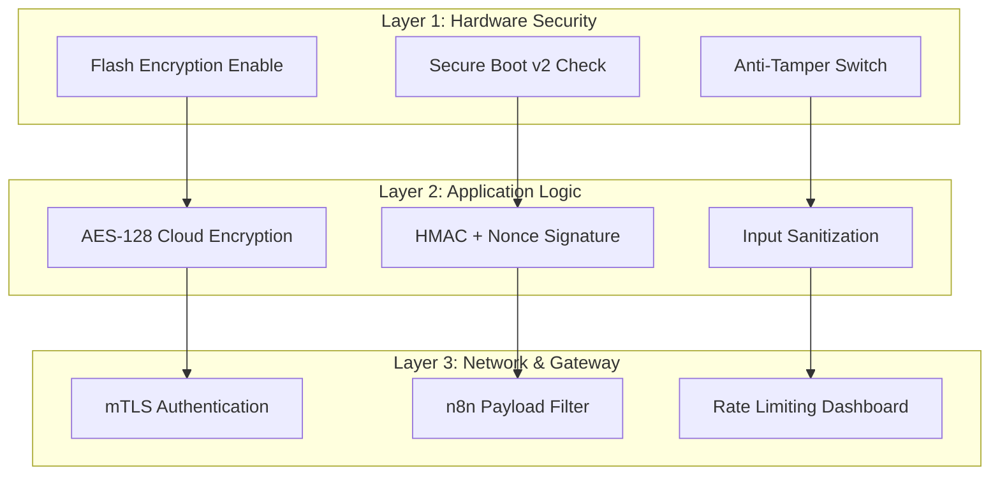

<!-- [SME_MANDATE] -->
<!-- 
  Lesson ID: HP7-12
  Title: Peak Assessment - Xây dựng "Pháo đài số" của Smart Home
  Phase: Phase 4 | Producing
  Version: v1.1 | Ngày: 2026-04-08
-->

---

## 0. Tổng quan Thử thách (Mission Briefing)

- **Thời lượng:** 120 phút (60' Build - 40' Attack - 20' Review)
- **Mục tiêu:** Xây dựng hệ thống phòng thủ đa lớp (Defense-in-Depth) cho một Smart Home IoT Kit thực tế.
- **Tiêu chuẩn học thuật:** [SME_MANDATE]
- **Kiểu đánh giá:** Performance-based Assessment (Đánh giá qua hành động).

---

## 1. THE CHALLENGE (Thử thách) — "Digital Fortress"

Chào mừng các chuyên gia! Bạn nhận được nhiệm vụ "hàn gắn" một hệ thống Smart Home đang bị hổng từ trong ra ngoài. Trong vòng 60 phút, bạn phải nâng cấp hệ thống này thành một **Pháo đài kỹ thuật số** trước khi "Hacker Red Team" (Giáo viên hoặc nhóm đối phương) thực hiện đợt tấn công tổng lực.

---

## 2. DEFENSE-IN-DEPTH (Phòng thủ Đa lớp)

Một hệ thống được coi là an toàn phải thể hiện được sự phối hợp giữa 3 rào chắn chính:

---

## 3. MISSION PACK (Bộ dụng cụ & Công cụ)

- **Công cụ theo dõi:** [Challenge_Coordinator_Hub](file:///Users/tonypham/MEGA/my-agents/packages/the-ultimate-curriculum-agent-os/projects/pathway-aiot/_code/hp7/lesson_12/security_summit_hub.py)
- **Kịch bản Tấn công (The Attacks):**
    - **Replay Attack:** Capture và gửi lại bản tin `{"cmd": "unlock"}` cũ.
    - **Brute Force:** Sử dụng script Python thử dò mã PIN 3 chữ số qua Web Interface.
    - **Plaintext Sniffing:** Đọc dữ liệu cảm biến thô qua Wireshark/Serial Plotter.
    - **Flash Reading:** Thử trích xuất firmware firmware từ chip ESP32 bằng `esptool.py`.

---

## 4. EVALUATION GUIDE (Tiêu chí chấm điểm)

| Phân hạng | Tiêu chí | Mô tả Năng lực |
| :--- | :--- | :--- |
| **Sĩ quan (Pass)** | **Bảo mật tối thiểu** | Hệ thống chống được Replay Attack và có mã hóa TLS cơ bản. |
| **Đại úy (Distinction)** | **Bảo vệ phần cứng** | Đã bật Flash Encryption / Secure Boot. Chống được việc đọc trộm code vật lý. |
| **Tướng quân (Elite)** | **Bảo mật đa lớp** | Sống sót qua 4/4 kịch bản tấn công. Có nhật ký log đầy đủ và bài trình bày ấn tượng. |

---

## 5. ĐẠO ĐỨC & TRÁCH NHIỆM (Ethics)

> [!CAUTION]
> **QUY TẮC PEN-TESTER:** "With great power comes great responsibility." Nghiêm cấm sử dụng các công cụ học được để tấn công các hệ thống nằm ngoài phạm vi phòng Lab này. Mọi hành vi vi phạm sẽ bị đình chỉ thử thách ngay lập tức.

---

## 6. Slide Design (Thiết kế Bài giảng)

| Slide # | Tiêu đề | Nội dung chính | Ghi chú minh họa |
| :--- | :--- | :--- | :--- |
| S1 | Security Summit | Lễ ra quân và Giao nhiệm vụ đặc biệt | Slide tối màu, chữ Neon đậm chất Cyber |
| S2 | The Mission Pack | Giới thiệu công cụ hỗ trợ và Mock Server | Hình ảnh các rương trang bị kỹ thuật 📦 |
| S3 | Armor Layers | Giải thích mô hình Defense-in-Depth | Animation các lớp khiên bảo vệ chồng lên nhau |
| S4 | Rule of Engagement | Quy tắc thi đấu Đỏ - Xanh & Điểm thưởng | Icon 🔴 vs 🔵 |
| S5 | The Dashboard | Cách xem trạng thái Teams theo thời gian thực | Ảnh chụp màn hình script `SecuritySummitHub` |
| S6 | Challenge Phase 1 | 60 Phút "vàng" để Build Pháo đài | Đồng hồ đếm ngược kịch tính ⏳ |
| S7 | Challenge Phase 2 | Cuộc tổng tấn công (The Blitz) | Hiệu ứng âm thanh cảnh báo (Siren - tùy chọn) |
| S8 | Review & Honor | Vinh danh các "Tướng quân" bảo mật | Bảng vàng vinh danh các đội sống sót |
| S9 | Closing | Security is a Team Sport | Ảnh cả lớp ăn mừng sau thử thách |

---
_Ghi chú cho SME: Hãy chuẩn bị sẵn các "Flag" (Cờ hiệu) bí mật trong code nếu muốn tổ chức theo dạng Capture The Flag (CTF)._
\n