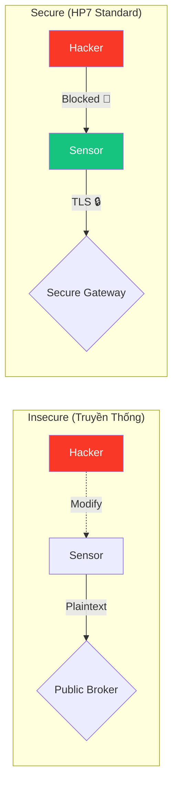

---
marp: true
theme: default
paginate: true
header: "HP7: Cyber Security for AIoT | Bài 01"
footer: "© Pathway AIoT Curriculum | @content"
style: |
  section {
    background-color: #050a14;
    color: #c9d1d9;
    font-family: 'Segoe UI', Tahoma, Geneva, Verdana, sans-serif;
  }
  h1 {
    color: #00BFFF;
    text-shadow: 0 0 10px rgba(0, 191, 255, 0.5);
  }
  h2 {
    color: #58a6ff;
  }
  code {
    background-color: #0d1117;
    color: #79c0ff;
    border: 1px solid #30363d;
  }
  blockquote {
    background: rgba(88, 166, 255, 0.1);
    border-left: 5px solid #00BFFF;
    color: #8b949e;
  }
  .cite {
    font-size: 0.8em;
    color: #8b949e;
  }
---

<!-- 
  Lesson: HP7.01 - Vũ khí của Hacker & Giáp trụ của Kỹ sư IoT
  Theme: Cyber Blue
-->

## Unit 7: Security & Global Connectivity

---

# 1. ENGAGE: Bữa sáng rực lửa 🔥

> **Câu chuyện:** Một chiếc lò nướng thông minh bị hacker chiếm quyền, tăng nhiệt độ tối đa liên tục gây hỏa hoạn.

- **Ai có lỗi?** Nhà sản xuất, người dùng, hay kỹ sư viết code?
- **Sự thật:** Một dòng code hớ hênh có thể gây nguy hiểm đến tính mạng, không chỉ là mất dữ liệu.

<!-- notes: Kể chuyện ngắn gọn, gây tò mò về trách nhiệm của kỹ sư. -->

---

# 2. EXPLORE: Đột nhập Trạm thời tiết

**Thử thách:** Hãy tìm 3 cách để "phá" hệ thống này mà không cần chạm vào phần cứng:
`Sensor -> ESP32 -> WiFi -> MQTT -> Dashboard`

- Nhóm 3 học sinh.
- Thời gian: 10 phút brainstorm.
- **Gợi ý:** Gửi tin nhắn giả, rút mạng ảo, làm máy bận...

<!-- notes: Khuyến khích học sinh nghĩ "out of the box", chưa cần dùng thuật ngữ kỹ thuật. -->

---

# 3. CONCEPT: Bề mặt tấn công (Attack Surface)

Hệ thống IoT giống như một ngôi nhà:
- **Nhà truyền thống:** Chỉ có cửa chính, cửa sổ.
- **Nhà IoT:** Thêm cửa lách (WiFi), khe hở (Bluetooth), ống khói (Cloud), cửa sổ ảo (Mobile App).

**Nhiệm vụ:** Kỹ sư phải biết mọi "lối vào" mà hacker có thể lợi dụng.

---

# 4. STRIDE: Vũ khí của Hacker ⚔️

Mô hình 6 mối đe dọa (Microsoft):

1. **S**poofing: Giả mạo thiết bị.
2. **T**ampering: Sửa đổi dữ liệu/firmware.
3. **R**epudiation: Xóa dấu vết, chối bỏ hành vi.
4. **I**nformation Disclosure: Rò rỉ dữ liệu nhạy cảm.
5. **D**enial of Service: Làm quá tải hệ thống.
6. **E**levation of Privilege: Chiếm quyền điều khiển cao hơn.

---

# 5. CIA TRIAD: Giáp trụ của Kỹ sư 🛡️

3 trụ cột phòng thủ:

- **C**onfidentiality: Bảo mật (Mã hóa). ➔ Chống lại **I**.
- **I**ntegrity: Toàn vẹn (Hash). ➔ Chống lại **T, S**.
- **A**vailability: Sẵn sàng (Uptime). ➔ Chống lại **D**.

**Tư duy:** Đừng chỉ hỏi "Nó chạy thế nào?", hãy hỏi "Nó có thể bị phá thế nào?".

---

# 6. So sánh: Insecure vs Secure AIoT

<!-- notes: Nhấn mạnh sự khác biệt giữa gửi dữ liệu trống và dữ liệu có mã hóa. -->

---

# 7. ELABORATE: Trải nghiệm Hacker 💻

### Hoạt động 1: Lắng nghe âm thầm
- Sử dụng **MQTT Explorer**.
- Kết nối vào Broker không bảo mật.
- Tìm kiếm các Topic "nhạy cảm" (như nhiệt độ, trạng thái khóa).

### Hoạt động 2: Tấn công Tampering (T)
- Gửi message đè lên Topic của nhóm bạn.
- Quan sát Dashboard thay đổi số liệu cực đoan.

---

# 8. EVALUATE: Tổng kết bài học

**Quiz nhanh:**
Việc hacker sửa đổi firmware của bạn khi bạn đang ngủ thuộc chữ cái nào trong STRIDE?
- A. Spoofing
- B. Tampering
- C. Information Disclosure

**Đáp án:** **B - Tampering**

<!-- notes: Giải thích thêm về sự khác biệt giữa Spoofing (giả mạo ai đó) và Tampering (sửa cái gì đó). -->

---

# Security Mindset 🧠

> "Bảo mật không phải là một tính năng gắn thêm vào sau cùng. Nó là nền móng ngay từ dòng code đầu tiên."

**Bài sau:** Tìm hiểu về mô hình bảo mật 7 lớp của OSI.

