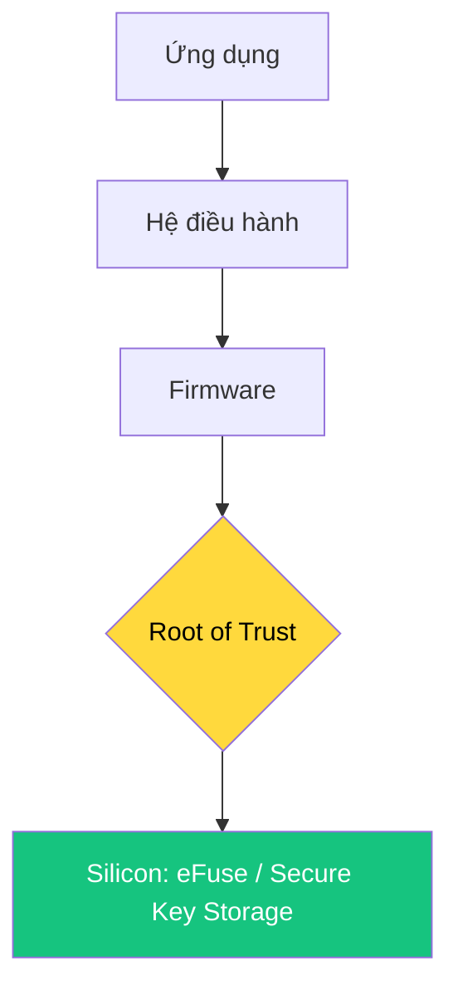

## IoT Security | Mật mã học cơ bản


---

# 1. ENGAGE: Bức thư tuyệt mật ✉️

**Thử thách:** Làm sao để gửi một vật quý giá trong hộp mà không ai ở giữa có thể lấy được (kể cả khi không có chìa khóa sẵn)?

- Dữ liệu trên WiFi giống như cái hộp luồn qua khe cửa.
- Chúng ta cần "khóa" nó lại bằng **Toán học**.

<!-- notes: Dẫn dắt học sinh hiểu rằng mã hóa là công nghệ thay thế cho những ổ khóa vật lý. -->

---

# 2. CONCEPT: Root of Trust (RoT)

Bảo mật bắt đầu từ tầng "cứng" nhất của con chip:



**Mỏ neo tin cậy:** Nếu phần cứng bị thỏa hiệp, mọi phần mềm bên trên đều vô nghĩa.

---

# 3. Hàm Hash: "Dấu vân tay" dữ liệu

Hash **KHÔNG PHẢI** là mã hóa (vì không thể giải ngược).

- **Ví dụ:** Con bò ➔ Burger. Bạn không thể biến Burger ngược lại thành con bò.
- **Tính chất:** Chỉ cần thay đổi 1 bit dữ liệu, chuỗi Hash sẽ thay đổi hoàn toàn (**Avalanche Effect**).
- **Ứng dụng:** Kiểm tra tính toàn vẹn của Firmware (Integrity).

<!-- notes: Nhấn mạnh Hash là "một đi không trở lại". Một công cụ để kiểm tra sự thay đổi dữ liệu. -->

---

# 4. Mã hóa Đối xứng (Symmetric)

Sử dụng **1 Chìa khóa** duy nhất cho cả Gửi và Nhận.

- **Thuật toán tiêu biểu:** **AES** (Advanced Encryption Standard).
- **Ưu điểm:** Tốc độ cực nhanh (ESP32 hỗ trợ phần cứng).
- **Nhược điểm:** Khó khăn trong việc chia sẻ khóa an toàn.

> **Analogy:** Một chiếc két sắt mà cả hai người đều giữ bản sao của cùng một chiếc chìa.

---

# 5. Mã hóa Bất đối xứng (Asymmetric)

Sử dụng **Cặp khóa**: Khóa công khai (Public) & Khóa bí mật (Private).

- **Thuật toán tiêu biểu:** **RSA**, **ECC**.
- **Hoạt động:** Ai cũng có thể "khóa" (Public), nhưng chỉ chủ nhân mới có thể "mở" (Private).
- **Ứng dụng:** Trao đổi khóa an toàn và Chữ ký số.

<!-- notes: Giải thích ví dụ hòm thư: Ai cũng có thể nhét thư vào khe (Public), nhưng chỉ chủ nhà có chìa mở hòm (Private). -->

---

# 6. LAB: Nấu lẩu dữ liệu với CyberChef 👨‍🍳

Trải nghiệm tại: [gchq.github.io/CyberChef](https://gchq.github.io/CyberChef/)

1. Nhập: `Hello IoT World`.
2. Dùng **SHA256**: Quan sát "dấu vân tay".
3. Thử đổi chữ `H` thành `h`: Thấy sự khác biệt cực lớn.
4. Thử **AES Encrypt**: Với key `curriculum123`.

---

# 7. DEMO: Lập trình AES với Python

Sử dụng thư viện `pycryptodome` để bảo vệ dữ liệu:

```python
from Crypto.Cipher import AES
# Quy trình mã hóa:
# 1. Tạo Cipher với Key và IV
# 2. Xử lý Padding (đệm dữ liệu)
# 3. Encrypt sang Base64
```

<!-- notes: Giới thiệu IV (Initialization Vector) - giúp cho cùng một nội dung nhưng mã hóa ra kết quả khác nhau mỗi lần. -->

---

# 8. TỔNG KẾT: Lớp giáp bảo vệ

- **Hash:** Đảm bảo dữ liệu không bị sửa (Integrity).
- **Symmetric (AES):** Mã hóa nhanh dữ liệu Sensor.
- **Asymmetric (RSA/ECC):** Xác thực và trao đổi khóa.

**Câu hỏi:** Tại sao không dùng RSA cho mọi thứ?
**Đáp án:** Vì nó rất chậm so với AES trên các thiết bị IoT yếu như ESP32.

---

# Hoạt động về nhà 🏠

- Cài đặt thư viện `pycryptodome` trên máy tính cá nhân.
- Thử mã hóa tên của bạn bằng AES-CBC và gửi cho bạn thân giải mã!

