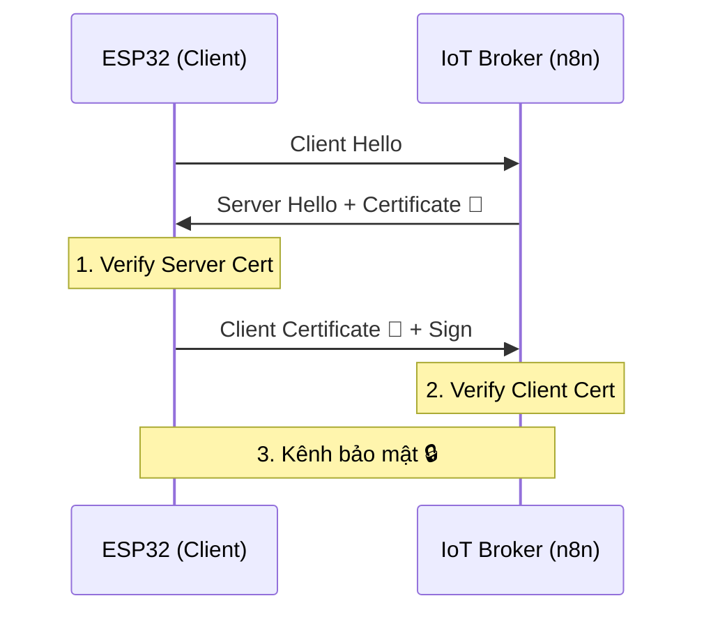

---
marp: true
theme: default
paginate: true
header: "HP7: Cyber Security for AIoT | Bài 03"
footer: "© Pathway AIoT Curriculum | @content"
style: |
  section {
    background-color: #050a14;
    color: #c9d1d9;
    font-family: 'Segoe UI', Tahoma, Geneva, Verdana, sans-serif;
  }
  h1 {
    color: #00BFFF;
    text-shadow: 0 0 10px rgba(0, 191, 255, 0.5);
  }
  h2 {
    color: #58a6ff;
  }
  code {
    background-color: #0d1117;
    color: #79c0ff;
    border: 1px solid #30363d;
  }
  blockquote {
    background: rgba(88, 166, 255, 0.1);
    border-left: 5px solid #00BFFF;
    color: #8b949e;
  }
---

<!-- 
  Lesson: HP7.03 - Định danh & Xác thực: "Passport" của những cỗ máy
  Theme: Cyber Blue
-->


## IoT Security | Chứng chỉ số & PKI


---

# 1. ENGAGE: Câu chuyện ở "Cửa khẩu số" 🛂

Hãy tưởng tượng bạn đang đi du lịch nước ngoài. Nhân viên an ninh không hỏi "Bạn là tên gì?", họ hỏi:

> **"Xin cho xem hộ chiếu của bạn?"**

Trong IoT, thiết bị cũng cần một loại "Hộ chiếu":
- **Identity (Định danh):** "Tôi là cảm biến số 01".
- **Authentication (Xác thực):** "Đây là chứng chỉ do Server uy tín cấp để chứng minh điều đó".

---

# 2. Identity vs Authentication

| Khái niệm | Ý nghĩa | Ví dụ thực tế |
| :--- | :--- | :--- |
| **Định danh (ID)** | Khai báo bạn là ai | Bảng tên, MAC Address |
| **Xác thực (Auth)** | Chứng minh lời nói | Hộ chiếu, Chứng chỉ số |

**Lỗ hổng:** MAC Address rất dễ bị giả mạo (**Spoofing**). Hacker có thể "đổi tên" chỉ trong 1 giây bằng phần mềm.

<!-- notes: Giải thích thêm về rủi ro khi chỉ dùng MAC address để xác thực thiết bị. -->

---

# 3. PKI: Hệ thống tin cậy (Public Key Infrastructure)

Để Certificate hoạt động, chúng ta cần một **CA (Certificate Authority)** - Nhà phát hành hộ chiếu uy tín.

1. **Thiết bị:** Gửi yêu cầu ký (CSR).
2. **CA:** Ký tên vào Public Key của Thiết bị bằng **Con dấu Root CA**.
3. **Kết quả:** Một **Digital Certificate** (Chứng chỉ số) chuẩn X.509.

---

# 4. Hộ chiếu số X.509: Có gì bên trong? 📜

Một chứng chỉ chuẩn bao gồm:

- **Chủ sở hữu:** Tên thiết bị, ID.
- **Nhà phát hành:** Tên của tổ chức CA.
- **Thời hạn:** Ngày hết hạn Cert.
- **Public Key:** Khóa dùng để mã hóa bí mật.
- **Chữ ký số:** Dùng để kiểm tra xem Cert có bị sửa hay không.

<!-- notes: Nhấn mạnh rằng chữ ký số là phần quan trọng nhất để chống lại hành vi Tampering (T). -->

---

# 5. Quy trình mTLS (Mutual TLS) 🛡️

Trong IoT, **CẢ HAI** phải tin tưởng nhau:



<!-- notes: Giải thích tại sao mTLS an toàn hơn TLS thông thường (trong mTLS, Server cũng kiểm tra ngược lại thiết bị). -->

---

# 6. LAB: openssl - Xưởng đúc chứng chỉ 🛠️

Học sinh thực hành tạo Root CA và Ký nhận thiết bị:

```bash
# 1. Tạo Root CA Key
openssl genrsa -out rootCA.key 2048

# 2. Tạo Certificate Signing Request (CSR) cho ESP32
openssl req -new -key esp32.key -out esp32.csr

# 3. CA ký xác nhận cho ESP32
openssl x509 -req -in esp32.csr -CA rootCA.pem ...
```

---

# 7. Bảo mật Key trên Thiết bị

Nếu mất **Private Key**, hộ chiếu của bạn có thể bị kẻ khác sử dụng!

- **Lưu trữ an toàn:** Trên ESP32, Key nên được lưu trong phân vùng mã hóa (NVS) hoặc SPIFFS bảo mật.
- **Nguyên tắc vàng:** "Public Key để cho đi, Private Key giữ lại trọn đời".

<!-- notes: Nhấn mạnh việc không bao giờ commit Private Key lên GitHub. -->

---

# 8. Q&A: Thảo luận nhanh 💬

1. Nếu hacker lấy mất Private Key của Root CA, điều gì tồi tệ nhất sẽ xảy ra?
2. Tại sao mật khẩu "vừng ơi mở ra" vẫn không an toàn bằng Chứng chỉ số?

**Bài sau:** Thực hành thiết lập mTLS thực tế trên Broker n8n.

