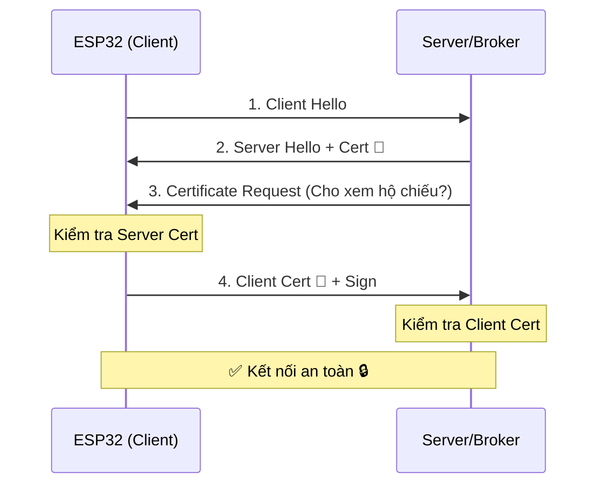

---
marp: true
theme: default
paginate: true
header: "HP7: Cyber Security for AIoT | Bài 04"
footer: "© Pathway AIoT Curriculum | @content"
style: |
  section {
    background-color: #050a14;
    color: #c9d1d9;
    font-family: 'Segoe UI', Tahoma, Geneva, Verdana, sans-serif;
  }
  h1 {
    color: #00BFFF;
    text-shadow: 0 0 10px rgba(0, 191, 255, 0.5);
  }
  h2 {
    color: #58a6ff;
  }
  code {
    background-color: #0d1117;
    color: #79c0ff;
    border: 1px solid #30363d;
  }
  blockquote {
    background: rgba(88, 166, 255, 0.1);
    border-left: 5px solid #00BFFF;
    color: #8b949e;
  }
---

<!-- 
  Lesson: HP7.04 - Lab: Thiết lập mTLS - "Cái bắt tay" tin cậy tuyệt đối
  Theme: Cyber Blue
-->


## Unit 7: Security | Mutual TLS


---

# 1. ENGAGE: Lòng tin hai chiều 🛡️

**Vấn đề:** Trong HTTPS thông thường, bạn tin Server. Nhưng làm sao Server biết nó có nên tin bạn không?

**mTLS (Mutual TLS) là giải pháp:**
- Server kiểm tra "Hộ chiếu" của ESP32.
- ESP32 kiểm tra "Thẻ ngành" của Server.

> **Chỉ khi cả hai cùng tin nhau, dữ liệu mới được trao đổi.**

---

# 2. Tại sao cần mTLS trong IoT?

- Ngăn chặn tấn công **Man-in-the-Middle (MITM)**.
- Đảm bảo chỉ những thiết bị "chính chủ" (đã được ký bởi Root CA) mới được gửi dữ liệu lên Broker.
- Bảo vệ dữ liệu nhạy cảm của khách hàng ngay từ nguồn.

<!-- notes: MITM là khi hacker đứng giữa, giả làm server để lấy dữ liệu từ thiết bị. -->

---

# 3. Luồng Handshake mTLS



<!-- notes: Nhấn mạnh bước 3 và 4 là điểm khác biệt của mTLS. -->

---

# 4. Tầm quan trọng của NTP ⏳

**Cảnh báo:** Chứng chỉ số có thời hạn (Expiration).

- ESP32 cần biết "Bây giờ là mấy giờ?" để kiểm tra chứng chỉ còn hạn hay không.
- **Bắt buộc:** Bạn phải đồng bộ thời gian từ Server NTP trước khi thực hiện handshake mTLS.
- **Lỗi phổ biến:** Quên đồng bộ NTP dẫn đến lỗi `Certificate Expired` hoặc `Not Yet Valid`.

---

# 5. LAB: Setup cho ESP32

Sử dụng thư viện `WiFiClientSecure` trong Arduino/ESP-IDF:

```cpp
WiFiClientSecure client;
client.setCACert(root_ca);      // Tin tưởng Server
client.setCertificate(client_cert); // Chứng minh mình là ai
client.setPrivateKey(client_key);   // Chữ ký bí mật
```

- **Mã nguồn mẫu:** `projects/pathway-aiot/_code/hp7/lesson_04/esp32_mtls.ino`

---

# 6. LAB: Server mô phỏng (Python)

Bạn sẽ chạy một ứng dụng Server đơn giản để kiểm tra "Hộ chiếu" của ESP32:

```python
import ssl
context = ssl.create_default_context(ssl.Purpose.CLIENT_AUTH)
context.load_cert_chain(certfile="server.pem", keyfile="server.key")
context.load_verify_locations(cafile="rootCA.pem")
context.verify_mode = ssl.CERT_REQUIRED
```

<!-- notes: Server này sẽ từ chối mọi kết nối không mang theo chứng chỉ được ký bởi rootCA.pem. -->

---

# 7. Troubleshooting: Gỡ lỗi SSL 🔍

Nếu kết nối thất bại, hãy kiểm tra:
- **Lỗi -1:** Sai định dạng PEM (thiếu dấu xuống dòng).
- **Lỗi -2:** Sai bộ Key/Cert (Key không khớp với Cert).
- **Lỗi -3:** Chứng chỉ chưa nạp đủ chuỗi Root CA.
- **Thời gian:** Kiểm tra `Serial Monitor` xem ESP32 đã lấy được giờ NTP chưa.

---

# 8. Thử thách thực hành 💻

1. **Success:** Dùng đúng Cert ➔ Kết nối thành công.
2. **Spoofing Fail:** Dùng Cert của người khác ➔ Server từ chối.
3. **NTP Fail:** Chỉnh sai giờ hệ thống ➔ Handshake lỗi.

**Yêu cầu:** Ghi lại log xác thực của Server để nộp bài.

---

# Summary 📋

- mTLS = Xác thực 2 chiều.
- Private Key là tài sản quý nhất, không được để lộ.
- **Next step:** Khi "kẻ địch" đã chiếm được thiết bị, mã hóa Flash là lớp bảo vệ cuối cùng.

