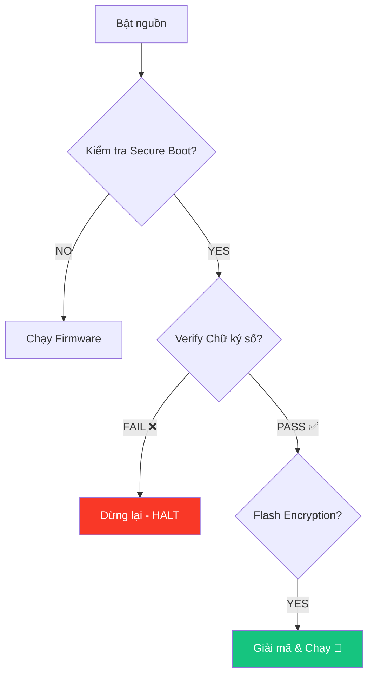

---
marp: true
theme: default
paginate: true
header: "HP7: Cyber Security for AIoT | Bài 05"
footer: "© Pathway AIoT Curriculum | @content"
style: |
  section {
    background-color: #050a14;
    color: #c9d1d9;
    font-family: 'Segoe UI', Tahoma, Geneva, Verdana, sans-serif;
  }
  h1 {
    color: #00BFFF;
    text-shadow: 0 0 10px rgba(0, 191, 255, 0.5);
  }
  h2 {
    color: #58a6ff;
  }
  code {
    background-color: #0d1117;
    color: #79c0ff;
    border: 1px solid #30363d;
  }
  blockquote {
    background: rgba(88, 166, 255, 0.1);
    border-left: 5px solid #00BFFF;
    color: #8b949e;
  }
---

<!-- 
  Lesson: HP7.05 - Hardware Protection: Lớp phòng thủ lớp cuối cùng
  Theme: Cyber Blue
-->


## Unit 7: Security | Secure Boot & Flash Encryption


---

# 1. ENGAGE: Khi Hacker có thiết bị trong tay 🛠️

**Kịch bản:** Sẽ ra sao nếu hacker đánh cắp thiết bị IoT của bạn và cắm nó vào máy tính của họ?

- Họ có thể dùng `esptool.py read_flash` để đọc trộm code?
- Họ có thể nạp Firmware độc hại vào chip để biến nó thành gián điệp?

> Bảo mật phần mềm là chưa đủ nếu thiết bị không có **Khả năng tự vệ vật lý**.

---

# 2. Flash Attack: Đọc trộm linh hồn thiết bị

Nếu không mã hóa, toàn bộ code (firmware), mật khẩu WiFi, và Certificate của bạn nằm lộ thiên dưới dạng **Plaintext** trên chip Flash.

- Hacker chỉ cần 4 sợi dây nối để sao chép toàn bộ trí tuệ của bạn.
- **Giải pháp:** Phải biến dữ liệu trên Flash thành "rác" đối với bất kỳ ai không có chìa khóa bên trong chip.

<!-- notes: Demo cho học sinh thấy mã hex thô khi chưa mã hóa. -->

---

# 3. Flash Encryption: Mã hóa AES trên Chip

- **Cơ chế:** ESP32 sử dụng module phần cứng AES-256 để mã hóa dữ liệu trước khi ghi vào Flash và giải mã khi đọc ra.
- **Chìa khóa (Key):** Được tạo ngẫu nhiên và lưu TRONG chip (eFuse). Không ai có thể đọc được key này từ bên ngoài.

> **Kết quả:** Ngay cả khi hacker nhổ chip Flash ra, họ chỉ thấy những con số vô nghĩa.

---

# 4. Secure Boot: Chỉ tin tưởng "Chính chủ" 📜

Làm sao ESP32 phân biệt được Firmware của bạn và Firmware của Hacker?

- **Chữ ký số (Digital Signature):** Bạn dùng Private Key để ký firmware.
- **Kiểm tra:** ESP32 dùng Public Key (đã lưu trong chip) để kiểm tra chữ ký lúc khởi động.

**Nguyên tắc:** Nếu chữ ký không khớp, chip sẽ tự động dừng lại và không chạy code độc hại.

---

# 5. Luồng Khởi động Bảo mật (Secure Boot Flow)



<!-- notes: Giải thích luồng kiểm tra đa tầng từ lúc vừa cấp nguồn. -->

---

# 6. eFuse: Cây cầu một chiều 🌁

Làm sao chip biết nó phải bật bảo mật mãi mãi?

- **eFuse** là các cầu chì điện tử siêu nhỏ bên trong chip.
- Khi ta "đốt" (Program) các eFuse này, nó sẽ thay đổi vĩnh viễn và không thể đảo ngược.
- Đây là nơi lưu trữ **Root of Trust** của thiết bị.

---

# 7. Quản lý Khóa (Keys Custody) 🔐

> **Mất Private Key = Mất quyền kiểm soát thiết bị.**

- Khóa dùng để ký firmware phải được lưu trữ cực kỳ an toàn (Két sắt, Hardware Security Module).
- Nếu lộ khóa, hacker có thể tạo ra firmware "chính chủ" giả mạo.

---

# 8. LAB: Firmware Signing 💻

Thực hành chuẩn bị các tệp tin bảo mật:

```bash
# 1. Tạo khóa bảo mật bằng OpenSSL
openssl genrsa -out secure_boot_signing_key.pem 3072

# 2. Kiểm tra log khởi động của ESP32
# (Quan sát các dòng thông báo về Flash Encryption & Secure Boot)
```

**Cảnh báo:** Không thực hiện "đốt" eFuse trên kit thực hành nếu không có sự hướng dẫn của thầy cô (Trẻ tránh Bricking!).

---

# 9. Summary & Risks 📋

- **Flash Encryption:** Chống đọc trộm.
- **Secure Boot:** Chống nạp code giả.
- **Nguy cơ:** Nếu bạn khóa chip và làm mất Key, bạn cũng không thể nạp lại code ➔ Thiết bị trở thành "Cục gạch" (Bricking).

**Checklist:** Luôn có bản sao lưu khóa bí mật!

