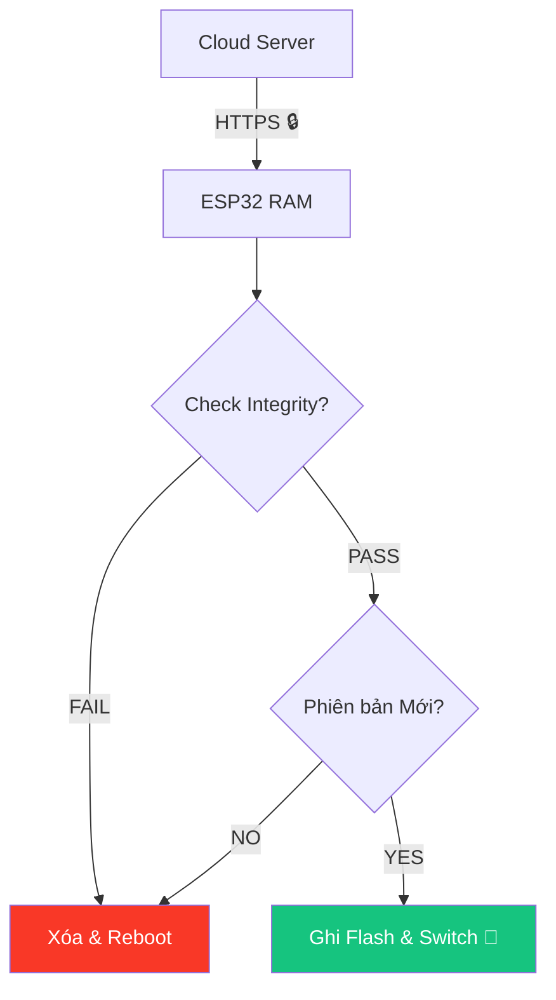

---
marp: true
theme: default
paginate: true
header: "HP7: Cyber Security for AIoT | Bài 06"
footer: "© Pathway AIoT Curriculum | @content"
style: |
  section {
    background-color: #050a14;
    color: #c9d1d9;
    font-family: 'Segoe UI', Tahoma, Geneva, Verdana, sans-serif;
  }
  h1 {
    color: #00BFFF;
    text-shadow: 0 0 10px rgba(0, 191, 255, 0.5);
  }
  h2 {
    color: #58a6ff;
  }
  code {
    background-color: #0d1117;
    color: #79c0ff;
    border: 1px solid #30363d;
  }
  blockquote {
    background: rgba(88, 166, 255, 0.1);
    border-left: 5px solid #00BFFF;
    color: #8b949e;
  }
---

<!-- 
  Lesson: HP7.06 - Secure OTA — Bản cập nhật từ "Người đưa thư" tin cậy
  Theme: Cyber Blue
-->

## Unit 7: Security | Secure Over-The-Air

---

# 1. ENGAGE: Cạm bẫy từ trên không 🛰️

**Kịch bản:** Thiết bị của bạn bỗng nhận được yêu cầu "Cập nhật khẩn cấp". Bạn đồng ý, nhưng thực ra đó là firmware giả mạo do hacker gửi tới.

- Hacker có thể biến hàng triệu bóng đèn thành botnet tấn công mạng.
- **Thách thức:** Làm sao thiết bị tin tưởng bản cập nhật đó đến từ "Chính chủ"?

> Cập nhật là tốt, nhưng cập nhật sai là một thảm họa diện rộng.

---

# 2. Phòng thủ 3 lớp (3-Layer Defense)

Để một bản OTA được chấp nhận, nó phải vượt qua:

1.  **Lớp 1 - Giao vận (Transport):** HTTPS/TLS.
2.  **Lớp 2 - Định danh (Identity):** Chữ ký số & SHA-256.
3.  **Lớp 3 - Chính sách (Policy):** Chống hạ cấp (Anti-rollback).

---

# 3. Lớp 1: Transport (Đường ống an toàn) 🔒

Dữ liệu firmware phải được tải thông qua **HTTPS**.

- **Mục đích:** Ngăn chặn việc hacker "nhìn trộm" code hoặc chèn mã độc vào file ngay trên đường truyền.
- **Yêu cầu:** ESP32 phải lưu sẵn **Root CA** của Cloud Storage để xác thực server tải file.

<!-- notes: Giống như việc gửi tiền qua xe bọc thép thay vì gửi bưu điện thông thường. -->

---

# 4. Lớp 2: Identity (Xác thực nội dung) 📜

ESP32 sẽ tính toán lại mã Hash (SHA-256) của file nhị phân vừa tải về.

- **So khớp:** Nếu mã Hash tính được khác với mã Hash đính kèm trong lệnh gửi ➔ Xóa firmware ngay lập tức.
- **Advanced:** Kiểm tra chữ ký số (Digital Signature) bằng Public Key để đảm bảo firmware không bị chỉnh sửa một bit nào.

---

# 5. Lớp 3: Policy (Chống hạ cấp) 🚧

**Tấn công Rollback:** Hacker ép thiết bị nạp lại bản Firmware Cũ (phiên bản vốn có lỗ hổng đã được vá).

- **Giải pháp:** Cơ chế **Anti-rollback**.
- Thiết bị sẽ lưu "Version hiện tại" vào eFuse. 
- Bất kỳ yêu cầu update nào có Version thấp hơn hoặc bằng ➔ Bị từ chối thẳng thừng.

---

# 6. Luồng tổng thể (Secure OTA Flow)

---

# 7. Orchestration: Vai trò của n8n 🤖

Trong dự án Pathway AIoT, **n8n** đóng vai trò là nhạc trưởng điều phối:

1.  **Nhận sự kiện:** Có bản firmware mới trên GitHub/Dropbox.
2.  **Tính toán:** Tự động tính SHA-256 của file mới.
3.  **Hạ lệnh:** Gửi thông điệp MQTT chứa `Link Tải` + `Mã Hash` cho hàng ngàn thiết bị cùng lúc.
4.  **Giám sát:** Theo dõi xem thiết bị nào đã cập nhật thành công.

---

# 8. Laboratory Practice 💻

Thực hành triển khai luồng OTA an toàn:

- **B1:** Dùng script Python để generate file `.bin` kèm thông tin Hash.
- **B2:** Đẩy file lên Cloud Storage.
- **B3:** Dùng n8n để bắn lệnh Update cho ESP32.
- **B4:** Quan sát Log Serial để thấy quá trình kiểm tra 3 lớp.

> **Thực hành:** Tấn công thử bằng cách sửa file .bin và xem ESP32 có từ chối không.

---

# 9. Summary & Best Practices 📋

**Checklist cho Secure OTA:**
- [ ] Luôn dùng HTTPS (TLS 1.2+).
- [ ] Luôn kiểm tra Firmware Signature/Hash.
- [ ] Bật Anti-rollback trong menuconfig.
- [ ] Chia thiết bị thành nhóm nhỏ (Canary deployment) trước khi thả quân hàng loạt.

