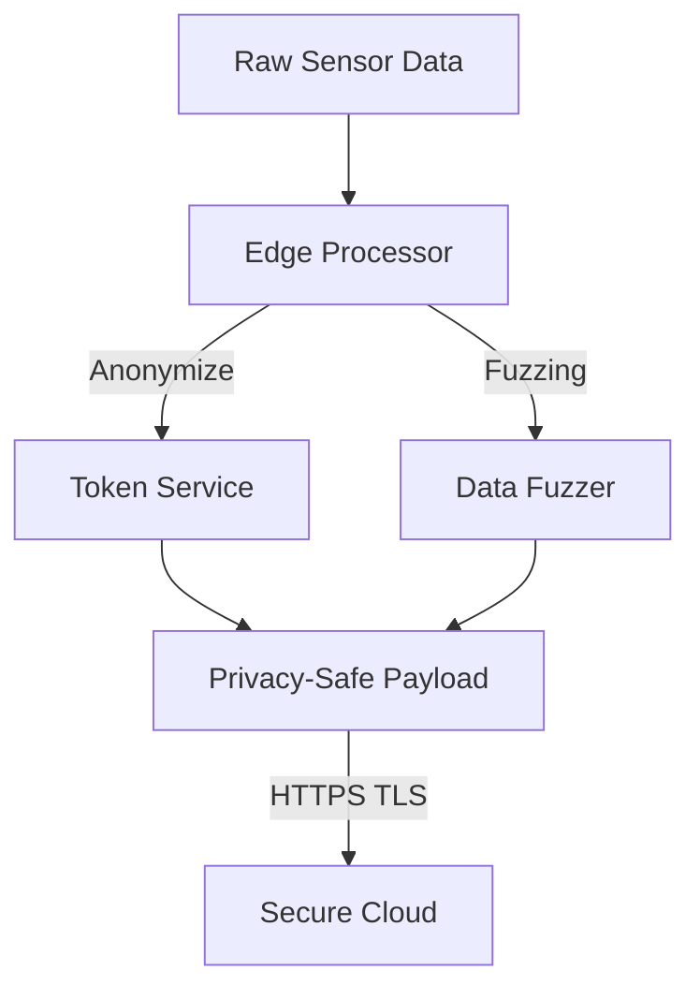

---
marp: true
theme: default
paginate: true
header: "HP7: Cyber Security for AIoT | Bài 08"
footer: "© Pathway AIoT Curriculum | @content"
style: |
  section {
    background-color: #050a14;
    color: #c9d1d9;
    font-family: 'Segoe UI', Tahoma, Geneva, Verdana, sans-serif;
  }
  h1 {
    color: #16C47F;
    text-shadow: 0 0 10px rgba(22, 196, 127, 0.5);
  }
  h2 {
    color: #58a6ff;
  }
  code {
    background-color: #0d1117;
    color: #79c0ff;
    border: 1px solid #30363d;
  }
  blockquote {
    background: rgba(22, 196, 127, 0.1);
    border-left: 5px solid #16C47F;
    color: #8b949e;
  }
---

<!-- 
  Lesson: HP7.08 - Data Privacy & GDPR - Bảo vệ quyền riêng tư người dùng
  Theme: Privacy Green-Blue
-->


## Unit 7: Security | Ethics & Privacy


---

# 1. ENGAGE: "Dấu chân số" của Sensor 👣

**Kịch bản:** Thiết bị đo nhịp tim gửi dữ liệu lên Cloud. Hacker có thể không biết bạn là ai, nhưng họ thấy:
- Bạn ngủ lúc mấy giờ?
- Bạn có hay căng thẳng không?
- Lịch trình sinh hoạt hàng ngày của bạn.

> Dữ liệu AIoT nếu rơi vào tay công ty bảo hiểm hoặc kẻ xấu có thể gây ra hậu quả khôn lường.

---

# 2. Privacy by Design: Quyền riêng tư ngay từ đầu

Hệ thống AIoT phải tuân thủ 3 nguyên tắc "Vàng":

1.  **Chỉ lấy những gì cần (Data Minimization):** Đừng lấy dữ liệu từng giây nếu trung bình mỗi phút là đủ.
2.  **Giới hạn mục đích (Purpose Limitation):** Dữ liệu nhịp tim không được dùng để bán quảng cáo thuốc.
3.  **Hết hạn dữ liệu (Data Expiry):** Tự động xóa dữ liệu cũ sau một khoảng thời gian.

---

# 3. Kỹ thuật #1: Fuzzing (Làm mờ dữ liệu) 🌫️

**Fuzzing** là kỹ thuật cố tình giảm độ chính xác của dữ liệu nhạy cảm.

- **Ví dụ GPS:** Thay vì gửi tọa độ chính xác đến từng mét của nhà riêng, ta làm tròn dữ liệu xuống 2 chữ số thập phân (~1.1km sai số).
- **Mục đích:** Vẫn thống kê được mật độ dân cư mà không lộ vị trí chính xác của từng cá nhân.

---

# 4. Kỹ thuật #2: Anonymize (Ẩn danh hóa) 👤

Loại bỏ mọi thông tin Định danh cá nhân (**PII** - Personally Identifiable Information).

- **Xóa bỏ:** Tên, Email, SĐT, Địa chỉ.
- **Thay thế:** Sử dụng các UUID hoặc Token ngẫu nhiên (ví dụ: `User_A12BC`).
- **Quy tắc:** Không thể truy ngược từ Token về danh tính thật nếu không có quyền truy cập Server bảo mật.

---

# 5. Kỹ thuật #3: Edge Processing 🧠

"Dữ liệu an toàn nhất là dữ liệu chưa bao giờ rời khỏi thiết bị."

- **Camera AI:** Xử lý ảnh tại chỗ, nhận diện có người hay không.
- **Chỉ gửi:** Con số `count=5` lên Cloud.
- **Tuyệt đối:** Không gửi hình ảnh thực tế lên Cloud để tránh nguy cơ rò rỉ hình ảnh riêng tư.

---

# 6. Sơ đồ Luồng dữ liệu Riêng tư



---

# 7. GDPR & Nghị định 13 ⚖️

- **GDPR (Châu Âu):** Tiêu chuẩn bảo vệ dữ liệu khắt khe nhất. Vi phạm có thể bị phạt hàng triệu Euro.
- **Nghị định 13 (Việt Nam):** Quy định về bảo vệ dữ liệu cá nhân tại Việt Nam, yêu cầu minh bạch và có biện pháp kỹ thuật bảo vệ.

> [!IMPORTANT]
> Người dùng có **"Quyền được lãng quên"**: Bạn phải cho phép họ yêu cầu xóa sạch dữ liệu của họ khỏi hệ thống của mình.

---

# 8. Lab: Data Anonymizer 💻

Thực hành bảo vệ dữ liệu bằng Python:

```python
# Thực hiện ẩn danh email và làm tròn tọa độ
def protect_data(raw_data):
    anon_id = hash(raw_data['email'])
    fuzzed_gps = round(raw_data['gps'], 2)
    return {"id": anon_id, "location": fuzzed_gps}
```

**Thử thách:** Viết script tự động xóa định danh khỏi bộ dữ liệu LOG của ESP32.

---

# Summary 📋

- Bảo mật là bảo vệ hệ thống.
- Quyền riêng tư là **Bảo vệ Con người**.
- Hãy luôn đặt câu hỏi: "Tôi có thực sự cần mẩu dữ liệu này không?"

