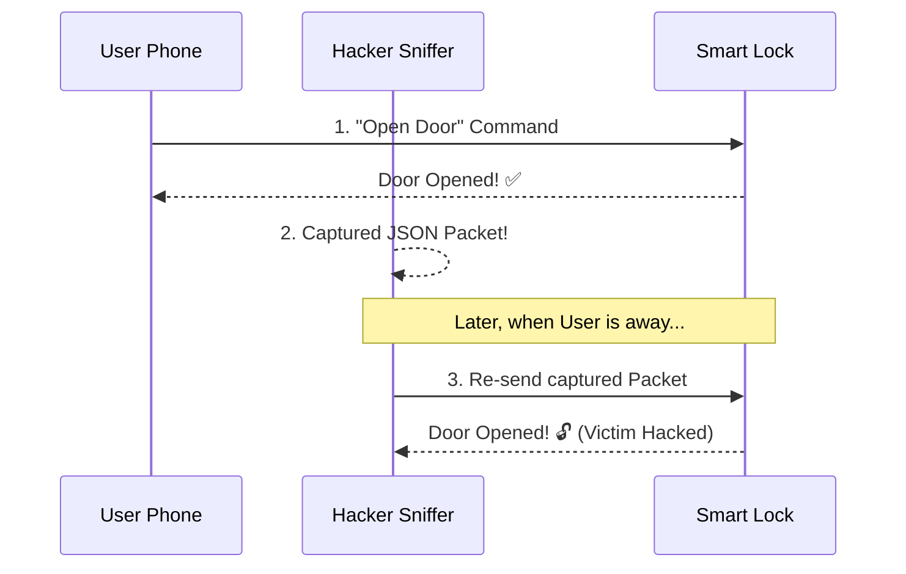

---
marp: true
theme: default
paginate: true
header: "HP7: Cyber Security for AIoT | Bài 09"
footer: "© Pathway AIoT Curriculum | @content"
style: |
  section {
    background-color: #050a14;
    color: #c9d1d9;
    font-family: 'Segoe UI', Tahoma, Geneva, Verdana, sans-serif;
  }
  h1 {
    color: #F93827;
    text-shadow: 0 0 10px rgba(249, 56, 39, 0.5);
  }
  h2 {
    color: #58a6ff;
  }
  code {
    background-color: #0d1117;
    color: #79c0ff;
    border: 1px solid #30363d;
  }
  blockquote {
    background: rgba(249, 56, 39, 0.1);
    border-left: 5px solid #F93827;
    color: #8b949e;
  }
---

<!-- 
  Lesson: HP7.09 - Pen-testing IoT 01 - Bắt chước "Người đưa tin"
  Theme: Attack Red-Blue
-->


## Unit 7: Security | Replay Attack & MITM


---

# 1. ENGAGE: Bắt chước "Người đưa tin" 🕵️‍♂️

**Kịch bản:** Bạn nhấn nút trên App để mở khóa cửa MQTT. Hacker đứng gần đó bắt được gói tin `{"action": "open"}`. 

- Hacker không cần biết mật khẩu là gì. 
- Họ chỉ cần "gửi lại" đúng đoạn mã đó ➔ **Cửa mở!**

> Đây là **Replay Attack** — một trong những lỗ hổng sơ đẳng nhưng chết người nhất trong IoT.

---

# 2. Replay Attack: Tấn công phát lại

Hacker giống như một người thu âm:
1.  **Capture:** Nghe trộm và lưu lại gói tin hợp lệ.
2.  **Re-send:** Phát lại gói tin đó vào thời điểm khác để đánh lừa thiết bị.

- **Vì sao thành công?** Vì thiết bị chỉ kiểm tra "Nội dung" lệnh mà không kiểm tra "Độ mới" (Freshness) của bản tin.

---

# 3. MITM (Man-in-the-Middle) 👤↔️🕵️↔️🏠

Hacker chen vào giữa thiết bị và server (ví qua một WiFi giả mạo hoặc chiếm quyền Gateway).

- Họ có thể:
  - Xem lén dữ liệu (Eavesdropping).
  - Chỉnh sửa nội dung lệnh (Tampering). Ví dụ: Sửa lệnh `Set Temp = 25` thành `Set Temp = 50`.

> [!WARNING]
> Ngay cả khi có TLS, nếu người dùng lỡ tay cài đặt một chứng chỉ (Cert) lạ của hacker, MITM vẫn có thể xảy ra.

---

# 4. Sơ đồ Tấn công (Attack Sequence)



---

# 5. Làm sao để bản tin "luôn mới"? ⏳

Để chống Replay, bản tin phải thay đổi theo thời gian:

- **Timestamp:** Gửi kèm thời gian hiện tại. Nếu lệnh cũ hơn 5 giây ➔ Từ chối.
- **Nonce (Number used once):** Một số ngẫu nhiên chỉ dùng 1 lần. Server sẽ lưu lại mã số này để không bao giờ chấp nhận lần thứ hai.

---

# 6. Message Integrity: Chống sửa đổi ✉️

Làm sao biết "Người đưa tin" không sửa đổi thư giữa đường?

- **HMAC (Hash-based Message Authentication Code):** 
  - Bạn "ký tên" vào bản tin bằng một Secret Key.
  - Khi hacker sửa 1 bit dữ liệu, chữ ký sẽ không còn khớp.
  - Thiết bị sẽ phát hiện ra bức thư đã bị bóc ra và dán lại.

---

# 7. Kỹ thuật HMAC + Nonce

```mermaid
graph LR
    A[Payload] + B[Nonce] --> C[Hash Function]
    C + D[Secret Key] --> E[HMAC Signature]
    E --> F[Send Secure Packet]
```

**Công thức bảo mật:** 
`Packet = JSON_Data + Nonce + HMAC(JSON_Data + Nonce, SecretKey)`

---

# 8. Lab: Hack the Lock 💻

**Thực hành:**
1.  Sử dụng MQTT Explorer để bắt lệnh từ ESP32.
2.  Thử gửi lại lệnh đó bằng Python script.
3.  **Quan sát:** ESP32 sẽ báo `REPLAY DETECTED` hoặc `INVALID TOKEN`.

**Mã nguồn:** `_code/hp7/lesson_09/attack_defense_sim.py`

---

# Summary 📋

- **Replay:** Gửi lại lệnh cũ. Chống bằng **Nonce/Timestamp**.
- **MITM:** Chỉnh sửa lệnh giữa đường. Chống bằng **HMAC/Signatures**.

**Quy tắc:** Đừng bao giờ tin tưởng một bản tin chỉ vì nó có định dạng đúng. Hãy kiểm tra "Danh tính" và "Thời gian" của nó!

