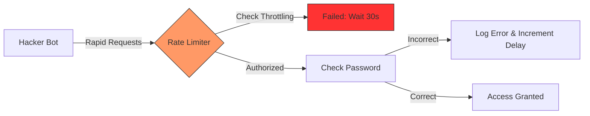

---
marp: true
theme: default
paginate: true
header: "HP7: Cyber Security for AIoT | Bài 10"
footer: "© Pathway AIoT Curriculum | @content"
style: |
  section {
    background-color: #050a14;
    color: #c9d1d9;
    font-family: 'Segoe UI', Tahoma, Geneva, Verdana, sans-serif;
  }
  h1 {
    color: #FFD700;
    text-shadow: 0 0 10px rgba(255, 215, 0, 0.5);
  }
  h2 {
    color: #58a6ff;
  }
  code {
    background-color: #0d1117;
    color: #79c0ff;
    border: 1px solid #30363d;
  }
  blockquote {
    background: rgba(255, 215, 0, 0.1);
    border-left: 5px solid #FFD700;
    color: #8b949e;
  }
---

<!-- 
  Lesson: HP7.10 - Brute Force & Rate Limit - Tấn công bằng "Sức mạnh thô"
  Theme: Gold-Blue Contrast
-->


## Unit 7: Security | Password Attacks


---

# 1. ENGAGE: Chìa khóa vạn năng 🔑

**Tình huống:** Bạn có một chiếc két sắt với mã PIN 4 chữ số (0000 - 9999). 
- Một người bình thường thử 1 mã mất 5 giây.
- Một máy tính có thể thử **10,000 mã/giây**.

**Brute Force:** Kỹ thuật thử mọi tổ hợp có thể cho đến khi tìm thấy chìa khóa đúng. Nếu không có rào chắn, két sắt của bạn sẽ mở trong chưa đầy 1 giây!

---

# 2. Dictionary Attack (Tấn công Từ điển) 📖

Thay vì thử mọi số, hacker dùng một danh sách các mật khẩu "phổ biến nhất thế giới":
- `admin/admin`
- `12345678`
- `password`
- `qwerty`

**Sự thật:** 80% các thiết bị IoT bị hack vì người dùng để mật khẩu mặc định hoặc mật khẩu quá dễ đoán.

---

# 3. Rate Limiting: Kỹ thuật "Câu giờ" ⏳

Làm sao để ngăn máy tính thử 10,000 lần/giây?

- **Cơ chế:** Nếu thử sai 3 lần, bắt đợi 30 giây.
- **Exponential Backoff:** Nếu tiếp tục sai, thời gian đợi tăng lên gấp đôi (60s, 120s, 240s...).
- **Kết quả:** Hacker phải mất hàng năm trời để thử hết các tổ hợp.

---

# 4. Sơ đồ Đối kháng (Request Flow)



---

# 5. Password Entropy: Độ phức tạp mật khẩu

Tại sao mật khẩu dài lại an toàn hơn mật khẩu chứa ký tự đặc biệt?

- **4 số (PIN):** 10,000 tổ hợp.
- **8 ký tự (Chỉ chữ):** 200 tỷ tổ hợp.
- **12 ký tự (Chữ + Số):** 3,000 tỷ tỷ tổ hợp.

> **Lời khuyên:** Hãy dùng Passphrase (một câu dài) thay vì mật khẩu ngắn khó nhớ.

---

# 6. Hashing & Salting: Tuyệt mật mật khẩu 🌪️

**Quy tắc:** Không bao giờ lưu mật khẩu dưới dạng văn bản (Plaintext) trong Database.

- **Hashing:** Chuyển mật khẩu thành một chuỗi mã không thể đảo ngược (ví dụ: SHA-256).
- **Salting:** Thêm một chuỗi ngẫu nhiên vào mật khẩu trước khi băm để chống lại bảng tra cứu (Rainbow Tables) của hacker.

---

# 7. Default-to-Secure 🛡️

Chính sách bảo mật tốt nhất cho thiết bị IoT thương mại:

1.  **Cấm mật khẩu mặc định:** Thiết bị không hoạt động cho đến khi người dùng đổi mật khẩu lần đầu.
2.  **Yêu cầu độ dài tối thiểu:** Ít nhất 8 ký tự.
3.  **Cảnh báo đăng nhập lạ:** Gửi thông báo về điện thoại khi có ai đó thử mật khẩu sai nhiều lần.

---

# 8. Lab: Cracking PIN 💻

Thực hành bẻ khóa và phòng thủ:

```python
# Script đối kháng mô phỏng
for pin in range(1000):
   response = login_request(pin)
   if response == "SUCCESS": 
       print(f"Hacked! PIN is {pin}")
       break
```

**Thực hành:** Cấu hình ESP32 để kích hoạt `delay(5000)` sau khi sai 3 lần. Cảm nhận sự thay đổi của tốc độ bẻ khóa!

---

# Summary 📋

- Mật khẩu yếu là món quà cho hacker.
- Dùng **Rate Limiting** để bảo vệ cổng đăng nhập.
- Luôn **Hash & Salt** mật khẩu khi lưu trữ.

