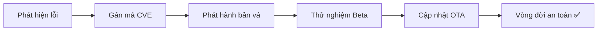

---
marp: true
theme: default
paginate: true
header: "HP7: Cyber Security for AIoT | Bài 11"
footer: "© Pathway AIoT Curriculum | @content"
style: |
  section {
    background-color: #050a14;
    color: #c9d1d9;
    font-family: 'Segoe UI', Tahoma, Geneva, Verdana, sans-serif;
  }
  h1 {
    color: #16C47F;
    text-shadow: 0 0 10px rgba(22, 196, 127, 0.5);
  }
  h2 {
    color: #58a6ff;
  }
  code {
    background-color: #0d1117;
    color: #79c0ff;
    border: 1px solid #30363d;
  }
  blockquote {
    background: rgba(22, 196, 127, 0.1);
    border-left: 5px solid #16C47F;
    color: #8b949e;
  }
---

<!-- 
  Lesson: HP7.11 - Vá lỗi & Hardening - Cuộc đua cùng Hacker
  Theme: Security Green-Blue
-->

## Unit 7: Security | Maintenance & Patching

---

# 1. ENGAGE: Cuộc đua không bao giờ kết thúc 🏁

**Tình huống:** Bạn vừa hoàn thành dự án. Sáng hôm sau, tin tức báo mã lỗi nghiêm trọng trong thư viện WiFi của ESP32.

Hacker có thể chiếm quyền điều khiển thiết bị của bạn từ xa bất cứ lúc nào!

**Bạn sẽ làm gì?**
- Tắt hệ thống?
- Đi đến từng nhà khách hàng để sửa?
- **Hay tìm cách vá nó thầm lặng qua Internet?**

---

# 2. CVE: Định danh lỗi bảo mật toàn cầu 🌍

**CVE (Common Vulnerabilities and Exposures):** Một danh sách các lỗi bảo mật máy tính được công khai.

- **Dạng:** `CVE-YYYY-NUMBER` (Ví dụ: `CVE-2023-xxxx`).
- **Mục đích:** Giúp các chuyên gia toàn cầu cùng nhau theo dõi và sửa lỗi ngay khi chúng mới xuất hiện.

> Đọc danh sách CVE mỗi ngày là thói quen của một chuyên gia bảo mật.

---

# 3. Vòng đời của một Lỗ hổng Bảo mật

---

# 4. System Hardening: Làm cứng hệ thống 🏰

**Hardening** là quá trình giảm diện tích tiếp xúc với nguy hiểm (Attack Surface).

**Triết lý:** Một thiết bị không dùng tính năng gì thì nên gỡ bỏ thư viện đó khỏi firmware.

- Càng ít thư viện dư thừa, càng ít kẽ hở cho hacker.
- Tăng hiệu suất, giảm dung lượng code.

---

# 5. Hardening Checklist cho ESP32 📋

1.  **Ports:** Đóng các cổng Telnet, FTP nếu không dùng.
2.  **UART:** Vô hiệu hóa log Serial trong bản thương mại (Hacker có thể đọc pass WiFi qua dây cắm!).
3.  **Credential Management:** Không lưu mật khẩu WiFi "fix cứng" trong code. Dùng file config riêng.
4.  **Libraries:** Luôn dùng phiên bản SDK mã hóa ổn định nhất.

---

# 6. Quản lý Phiên bản & Chiến lược Rollback 🔄

Khi vá lỗi, bạn có thể tạo ra lỗi mới!

- **Git Tagging:** Đánh dấu phiên bản v1.0.1, v1.0.2...
- **Rollback:** Luôn giữ một bản firmware cũ dự phòng trong bộ nhớ.
- **Quy trình:** Nếu cập nhật lỗi, ESP32 phải tự động quay về phiên bản cũ để không thành "cục gạch".

---

# 7. OTA Security: Cập nhật bản vá thầm lặng

Để bản vá đến được thiết bị an toàn, đường truyền OTA phải:

- **HTTPS (TLS):** Bản vá không bị đánh cắp trên đường truyền.
- **Signature Check:** ESP32 kiểm tra "chữ ký" xem bản vá có phải chính chủ phát hành không.
- **Progressive Rollout:** Cập nhật thử cho 5 thiết bị, nếu tốt mới đẩy cho 5,000 thiết bị còn lại.

---

# 8. Lab: Security Audit 💻

Đóng vai chuyên gia kiểm soát lỗi:

1.  Chạy script `vulnerability_scanner.py` để quét code của bạn mình.
2.  **Tìm lỗi:** Password để hở? Code cũ? Port thừa?
3.  **Vá lỗi:** Thực hiện sửa code và nâng cấp phiên bản `v1.1`.

> Một bản vá vội vàng có thể gây ra nhiều lỗ hổng hơn!

---

# Summary 📋

- Không có hệ thống nào là an toàn mãi mãi.
- **Patch** sớm, **Hardening** mạnh để sống sót trước hacker.
- Bảo mật là một **Quá trình liên tục**.

